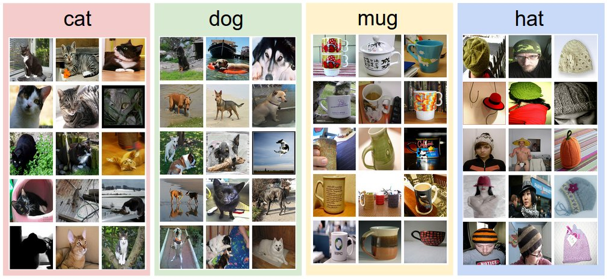
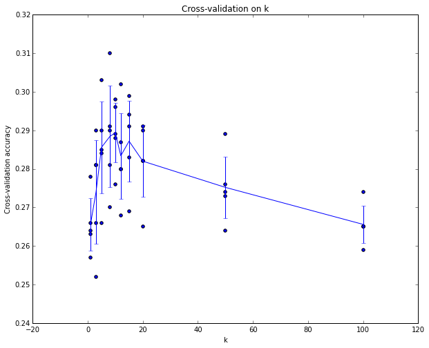
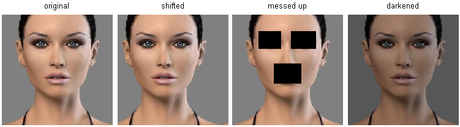

# 画像分類

## 導入

### 動機付け

本セクションでは「画像分類」の問題について紹介します。これは、入力画像に対して、あらかじめ定められたカテゴリの中から 1 つのラベルを割り当てるというタスクです。画像分類はコンピュータビジョンの中核をなす課題の一つであり、そのシンプルさにもかかわらず、さまざまな実用的な応用があります。さらに本講義の後半で見ていくように、物体検出やセグメンテーションといった一見異なるコンピュータビジョンのタスクも、多くは画像分類問題に還元することが可能です。

### 例

例えば以下の画像では、画像分類モデルが 1 枚の画像を受け取り、`{cat（猫）, dog（犬）, hat（帽子）, mug（マグカップ）}`という 4 つのラベルに対して確率を割り当てます。図に示されているように、コンピュータにとって画像とは、巨大な 3 次元の数値配列として表現されます。この例では、猫の画像は幅 248 ピクセル、高さ 400 ピクセルで、赤・緑・青の 3 つのカラーチャンネル（RGB）を持っています。したがって、この画像は 248 × 400 × 3 個、すなわち合計 297,600 個の数値から構成されています。各数値は 0（黒）から 255（白）までの整数であり、私たちの課題は、これらおよそ 30 万個の数値を「cat（猫）」といった 1 つのラベルへと変換することです。

{ loading=lazy }
/// caption
画像分類のタスクでは、与えられた画像に対して1つのラベル（あるいは、ここで示すように信頼度を表すラベル分布）を予測することが求められます。画像は、幅 × 高さ × 3 のサイズを持つ、0から255までの整数値からなる3次元配列として表されます。この「3」は、赤・緑・青の3つのカラーチャンネルを表しています。 
///

### 課題

この「視覚的な概念（例：猫）を認識する」というタスクは、人間にとっては比較的容易に思えるかもしれませんが、コンピュータビジョンのアルゴリズムにとっては多くの課題が伴います。以下に一部の代表的な課題を挙げますが、画像が明るさの数値からなる 3 次元配列として表現されることを念頭に置いてください。

- **視点の変化**：1 つの同じ物体でも、カメラに対する向きがさまざまである可能性があります。
- **スケールの変化**：物体は、そのサイズ（画像内だけでなく現実でも）にばらつきがあります。
- **変形**：多くの対象物は剛体ではなく、大きく変形する可能性があります。
- **遮蔽**：対象物の一部が他の物体に隠されてしまう場合があります。時には、数ピクセル程度しか見えないこともあります。
- **照明条件**：照明の違いはピクセルレベルで大きな影響を与えます。
- **背景のノイズ**：対象物が周囲の環境に溶け込んでしまい、識別が困難になることがあります。
- **クラス内変動**：例えば「椅子」というカテゴリには、形状や外観が大きく異なる多様な種類が含まれます。

優れた画像分類モデルは、これらすべての変動の直積に対して不変である必要がある一方で、異なるクラス間の違いにも同時に敏感でなければなりません。

{ loading=lazy }


### データ駆動型アプローチ

画像を異なるカテゴリに分類するアルゴリズムを作成するには、どのように進めればよいでしょうか。例えば数値のリストをソートするアルゴリズムを作る場合とは異なり、画像の中から猫を識別するアルゴリズムをどのように書けばよいかは明確ではありません。そのため、関心のあるそれぞれのカテゴリがどのように見えるかをコードで直接指定するのではなく、子どもに何かを教えるときのように、各クラスのたくさんの例をコンピュータに与え、それらの例を見て各クラスの視覚的特徴を学習するアルゴリズムを開発するという方法を取ります。

このような方法は「データ駆動型アプローチ」と呼ばれます。というのも、最初にラベル付き画像のトレーニングデータセットを収集することに依存しているためです。以下は、そのようなデータセットがどのようなものかを示す一例です。

{ loading=lazy }
/// caption
4つの視覚カテゴリに対する訓練セットの例。実際の応用では、カテゴリ数が数千に及び、各カテゴリに対して数十万枚の画像を用いることもあります。 
///

### 画像分類のパイプライン

画像分類のタスクでは、1 枚の画像を表すピクセル配列を入力として受け取り、それにラベルを割り当てることが目的であると紹介しました。私たちの完全なパイプラインは、以下のように形式化できます。

- **入力**：入力として、N 枚の画像からなる集合が与えられます。それぞれの画像には、K 種類のクラスのいずれかのラベルが付けられています。このデータを「_トレーニングセット_」と呼びます。

- **学習**：このトレーニングセットを使って、それぞれのクラスがどのように見えるのかを学習することが私たちの課題です。このステップは、「_分類器の学習_」あるいは「_モデルの学習_」と呼ばれます。

- **評価**：最終的には、分類器が初めて見る新しい画像に対してラベルを予測できるかを確認することで、その性能を評価します。そして、それらの画像に対する真のラベルと、分類器が予測したラベルとを比較します。直感的には、多くの予測が真の答え（これを「正解ラベル（ground truth）」と呼びます）と一致することを期待しています。

## Nearest Neighbor Classifier

最初のアプローチとして、「**最近傍法分類器（Nearest Neighbor Classifier）**」と呼ばれるものを開発してみます。この分類器は畳み込みニューラルネットワーク（Convolutional Neural Networks）とは無関係で、実際にはほとんど使われることのない手法ですが、画像分類問題における基本的なアプローチの考え方を理解するために役立ちます。

**画像分類のサンプルデータセット：CIFAR-10**

画像分類の入門用としてよく使われるデータセットの一つに「[CIFAR-10](https://www.cs.toronto.edu/~kriz/cifar.html)」があります。このデータセットは、高さと幅がそれぞれ 32 ピクセルの小さな画像 60,000 枚で構成されています。各画像には、「飛行機」「自動車」「鳥」など、10 種類のクラスのうちのいずれかのラベルが付けられています。

この 60,000 枚の画像は、50,000 枚のトレーニングセットと、10,000 枚のテストセットに分割されています。以下の画像には、各クラスからランダムに選ばれた 10 枚の例がそれぞれ表示されています。


{ loading=lazy }
/// caption
左側はCIFAR-10データセットの例。右側では、最初の列にいくつかのテスト画像を示し、その隣にはピクセル単位の差分に基づいて訓練セットから選ばれた上位10件の最近傍画像を示しています。
///

今、CIFAR-10 のトレーニングセット（各ラベルにつき 5,000 枚、合計 50,000 枚の画像）が与えられており、残りの 10,000 枚の画像にラベルを付けたいとしましょう。最近傍法分類器（Nearest Neighbor Classifier）は、テスト画像を 1 枚取り、それをすべてのトレーニング画像と比較し、最も近いトレーニング画像のラベルを予測として返します。

上記および右側の画像では、この手法を 10 枚のテスト画像に適用した結果の一例を見ることができます。注目すべきは、約 10 個中 3 個の例でしか正しいクラスの画像が取得されておらず、残りの 7 個では誤ったクラスの画像が取得されている点です。例えば、8 行目では馬の頭の画像に最も近いトレーニング画像が赤い車となっており、おそらく背景が黒で強調されていることが原因です。その結果、この馬の画像は車と誤認識されてしまいます。

ここでお気づきかもしれませんが、2 枚の画像をどのように比較するかの具体的な方法については、まだ明示していません。画像はどちらも 32×32×3 のブロックとして与えられるため、最も単純な比較方法の一つは、ピクセルごとに比較してその差をすべて合計することです。言い換えると、2 つの画像をベクトル $I_1$, $I_2$ として表現し、それらを比較する方法として合理的なのは、**L1 距離**を用いることです。

$$
d_1 (I_1, I_2) = \sum_{p} \left| I^p_1 - I^p_2 \right|
$$

ここでの「総和」はすべてのピクセルにわたって計算されます。以下にその手順を可視化したものを示します。


{ loading=lazy }
/// caption
ピクセル単位の差分を用いて2枚の画像をL1距離で比較する例（この例では1つのカラーチャンネルのみを使用しています）。2枚の画像を要素ごとに引き算し、すべての差分を合計して1つの数値にします。もし2枚の画像が完全に一致していれば結果は0になりますが、画像が大きく異なっていれば結果は大きな値になります。
///

次に、分類器をコードでどのように実装するかを見ていきましょう。まず、CIFAR-10 のデータをメモリに読み込み、4 つの配列として扱います。すなわち、訓練用データとラベル、テスト用データとラベルです。以下のコードでは、`Xtr`（サイズは 50,000 × 32 × 32 × 3）が訓練用のすべての画像を保持しており、対応する 1 次元配列`Ytr`（長さ 50,000）が訓練用のラベル（0 から 9 の値）を保持しています。

```python
Xtr, Ytr, Xte, Yte = load_CIFAR10('data/cifar10/') # 簡単のための魔法の関数
# すべての画像を一次元に平坦化する
Xtr_rows = Xtr.reshape(Xtr.shape[0], 32 * 32 * 3) # Xtr_rowsは50000 x 3072になる
Xte_rows = Xte.reshape(Xte.shape[0], 32 * 32 * 3) # Xte_rowsは10000 x 3072になる
```

すべての画像を行ベクトルとして展開したので、以下に分類器の訓練と評価を行う方法を示します。

```python
nn = NearestNeighbor()  # 最近傍分類器のクラスを作成します
nn.train(Xtr_rows, Ytr)  # 訓練画像とそのラベルで分類器を訓練します
Yte_predict = nn.predict(Xte_rows)  # テスト画像に対してラベルを予測します
# 次に分類精度（正しく予測された例の割合）を出力します
print 'accuracy: %f' % ( np.mean(Yte_predict == Yte) )

```

評価基準としては、予測が正解した割合を測る**精度（accuracy）**を使用するのが一般的であることに注意してください。今後作成するすべての分類器は、共通の API に従うことになります。それは、訓練データとラベルを受け取って学習を行う`train(X, y)`関数と、新しいデータに対してラベルを予測する`predict(X)`関数を備えているというものです。分類器の内部では、データからラベルを予測するための何らかのモデルが構築されます。もちろん、ここでは肝心の分類器の中身はまだ示していません。以下は、このテンプレートに準拠した、L1 距離を用いるシンプルな最近傍分類器の実装です。

```python
import numpy as np

class NearestNeighbor(object):
  def __init__(self):
    pass

  def train(self, X, y):
    """XはN×Dの配列で、各行が一つの訓練データを表します。YはサイズNの1次元配列です。"""
    # 最近傍分類器は、訓練データをそのまま記憶するだけです
    self.Xtr = X
    self.ytr = y

  def predict(self, X):
    """XはN×Dの配列で、各行が予測対象のデータを表します。"""
    num_test = X.shape[0]
    # 出力の型が入力の型と一致するようにします
    Ypred = np.zeros(num_test, dtype=self.ytr.dtype)

    # すべてのテストデータに対してループします
    for i in range(num_test):
      # i番目のテスト画像に最も近い訓練画像を探します
      # L1距離（絶対値の差の合計）を用います
      distances = np.sum(np.abs(self.Xtr - X[i, :]), axis=1)
      min_index = np.argmin(distances)  # 最も距離が小さいインデックスを取得します
      Ypred[i] = self.ytr[min_index]  # 最も近いデータのラベルを予測結果として代入します

    return Ypred
```

このコードを実行すると、この分類器は CIFAR-10 に対してわずか 38.6%の精度しか達成できないことがわかります。これは、ランダムに予測した場合（10 クラスあるため精度は 10%）よりははるかに優れていますが、人間の精度（[およそ 94%と推定される](https://karpathy.github.io/2011/04/27/manually-classifying-cifar10/)）や、約 95%の精度を達成して人間並みの性能を示す最新の畳み込みニューラルネットワーク（CNN）には到底及びません（CIFAR-10 に関する最近の Kaggle コンペティションの[リーダーボード](https://www.kaggle.com/c/cifar-10/leaderboard)を参照してください）。

**距離の選択について**：ベクトル間の距離を計算する方法にはさまざまな種類があります。もう一つの一般的な方法として、**L2 距離**を用いることもできます。これは、2 つのベクトル間のユークリッド距離を計算するという幾何学的な意味合いがあります。この距離は次の形になります。

$$
d_2 (I_1, I_2) = \sqrt{\sum_{p} \left( I^p_1 - I^p_2 \right)^2}
$$

つまり、以前と同様に画素ごとの差を計算しますが、今回はその差をすべて二乗し、それらを合計し、最後に平方根を取ります。NumPy を使った先ほどのコードでは、1 行だけ変更すれば対応できます。距離を計算している行を以下のように置き換えます。

```python
distances = np.sqrt(np.sum(np.square(self.Xtr - X[i,:]), axis = 1))
```

ここで`np.sqrt`を使って平方根を取っていますが、実際の最近傍法の応用では、この平方根の計算は省略しても問題ありません。なぜなら平方根は単調関数であり、距離の絶対値をスケーリングするだけで順位の順序は保たれるからです。つまり、平方根を取っても取らなくても、最も近い近傍は同じになります。この L2 距離を使って CIFAR-10 に対して最近傍分類器を実行すると、精度は 35.4%となり、L1 距離を用いた場合よりもやや低くなります。

L1 距離と L2 距離の違いを考えるのは興味深いことです。特に、2 つのベクトル間に差がある場合、L2 距離は L1 距離よりもその差に対して厳しく反応します。つまり、L2 距離は「大きな一つの違い」よりも「中程度の違いが複数ある」方を好む傾向があります。L1 距離と L2 距離（または、画像間の差分ベクトルに対する L1/L2 ノルム）は、[p ノルム](https://planetmath.org/vectorpnorm)と呼ばれる距離関数の中でも最もよく使われる特別なケースです。

## k - Nearest Neighbor Classifier

予測を行う際に、最も近い 1 枚の画像のラベルだけを使うのは不自然に感じたかもしれません。実際、より良い結果を得るためには、**k-近傍法分類器（k-Nearest Neighbor Classifier）**を使うのが一般的です。その考え方は非常にシンプルです。訓練セットの中から最も近い 1 枚だけでなく、最も近い上位**k**枚の画像を探し、それらによってテスト画像のラベルを多数決で決定するというものです。特に、*k = 1*のときは、通常の最近傍法（Nearest Neighbor Classifier）と同じになります。

直感的には、k の値を大きくすると分類器に平滑化効果が生まれ、外れ値に対してより頑健になります。

{ loading=lazy }
/// caption
2次元の点と3つのクラス（赤・青・緑）を用いた、最近傍分類器と5-近傍分類器の違いの例。色付きの領域は、L2距離を用いた分類器によって生成された決定境界を示しています。白い領域は、分類が曖昧な点（つまり、2つ以上のクラスで票が同数になった場合）を表しています。

最近傍分類器の場合、外れ値のデータ点（たとえば、青い点の集まりの中にある緑の点）が、誤分類の可能性が高い小さな「島」を作ってしまうことがあるのが分かります。一方、5-近傍分類器ではこうした不規則性が平均化され、テストデータ（ここでは表示されていません）に対してより良い汎化性能をもたらす可能性があります。

また、5-近傍の図に見られる灰色の領域は、最近傍の投票が同数になることで生じています（たとえば、2つの近傍が赤、次の2つが青、最後の1つが緑といったケースです）。
///

実際には、ほとんどの場合で k-近傍法を使用する方が望ましいです。しかし、k にどの値を選ぶべきかという問題が生じます。次に、この問題について考えていきます。

### ハイパーパラメータチューニングのための検証セット

k-近傍法分類器を使うには、k の値を設定する必要がありますが、どの値が最も良い結果をもたらすかは一概には言えません。さらに、距離関数にもさまざまな選択肢があります。L1 ノルムや L2 ノルムのほか、ここでは扱っていない内積なども考えられます。これらの設定は**ハイパーパラメータ**と呼ばれ、データから学習する多くの機械学習アルゴリズムの設計において非常に頻繁に登場します。どの値や設定が最適なのかは、通常すぐにはわかりません。

「さまざまな値を試して、どれが最も良いかを確認すればよいのでは？」と思うかもしれません。それは正しい考え方であり、実際に私たちもそうしますが、この作業は**非常に慎重に行う必要があります**。特に重要なのは、**テストセットをハイパーパラメータの調整に使ってはいけない**ということです。

機械学習アルゴリズムを設計する際には、テストセットを非常に貴重なリソースとして考えるべきであり、理想的には最後の一度きりしか使わないようにすべきです。そうしないと、テストセットに対してうまく動作するようにハイパーパラメータが調整されてしまい、実際にモデルを運用したときには性能が大きく低下するという、現実的なリスクがあります。これは、**テストセットへの過学習（overfitting）**が起きている状態です。

別の見方をすると、テストセットでハイパーパラメータを調整することは、実質的にそのテストセットを訓練に使っていることになり、その結果得られる性能は、実際の運用時に観測される性能よりも過度に楽観的な数値になってしまいます。しかし、テストセットを最後の一度しか使わなければ、分類器の**汎化性能（generalization）**を測るための良い指標として機能します（この汎化に関する議論は、今後の講義でさらに詳しく取り上げていきます）。

> テストセットでの評価は、最後の最後に 1 回だけ行う。

幸運なことに、ハイパーパラメータを調整する正しい方法があり、それはテストセットに一切触れることなく行えます。その方法とは、訓練セットをさらに 2 つに分割するというものです。つまり、少し小さめの訓練セットと、**検証セット（validation set）**を作成します。

たとえば CIFAR-10 の場合、訓練画像 5 万枚のうち 49,000 枚を実際の訓練に使い、残りの 1,000 枚を検証用に取っておくという形が考えられます。この検証セットは疑似的なテストセットとして使われ、ハイパーパラメータの調整に利用されます。

CIFAR-10 の場合の設定例は以下のようになります。

```python
# 先ほどと同様に、Xtr_rows, Ytr, Xte_rows, Yte があると仮定します
# Xtr_rows は 50,000 x 3072 の行列であることを思い出してください
Xval_rows = Xtr_rows[:1000, :]  # 最初の1000件を検証用に取り出します
Yval = Ytr[:1000]
Xtr_rows = Xtr_rows[1000:, :]  # 残りの49,000件を訓練用に使います
Ytr = Ytr[1000:]

# 検証セットで最も良い性能を示すハイパーパラメータを探索します
validation_accuracies = []
for k in [1, 3, 5, 10, 20, 50, 100]:

  # 特定のkの値を使い、検証データで性能を評価します
  nn = NearestNeighbor()
  nn.train(Xtr_rows, Ytr)
  # kを引数として受け取れるように修正されたNearestNeighborクラスを仮定します
  Yval_predict = nn.predict(Xval_rows, k=k)
  acc = np.mean(Yval_predict == Yval)
  print 'accuracy: %f' % (acc,)

  # 検証セットでの結果を記録します
  validation_accuracies.append((k, acc))
```

この手順を終えると、どの k の値が最も良い結果を出したのかを示すグラフを描くことができます。そして、その最良の k を選び、最後に一度だけ実際のテストセットで評価を行い、最終的な性能を報告します。

> 訓練セットを訓練セットと検証セットに分ける。検証セットを使ってすべてのハイパーパラメータを調整する。最後にテストセットで 1 回実行し、パフォーマンスを報告する。

### クロスバリデーション（Cross-validation）

もし訓練データのサイズ（検証データも含む）が小さい場合、ハイパーパラメータの調整にはより洗練された手法である**クロスバリデーション**を用いることがあります。

先ほどの例に基づくと、最初の 1000 個を検証用にし、それ以外を訓練用にするというような恣意的な分割ではなく、異なる検証セットを使って繰り返し評価を行い、その平均をとることで、特定の k に対するより良く、ばらつきの少ない性能の見積もりが得られます。

たとえば、5-fold クロスバリデーションでは、訓練データを 5 つの等しい部分に分割し、そのうち 4 つを訓練、1 つを検証として使います。そして、どの部分を検証にするかを 5 回切り替えて評価を行い、それぞれの結果を平均します。

この方法は、データが少ない場合にも信頼性の高いハイパーパラメータの選定が可能であり、過学習のリスクも軽減できます。


{ loading=lazy }
/// caption
kの値に対して5分割クロスバリデーションを実行した例。各kの値について、5つのフォールドのうち4つで訓練を行い、残りの1つで評価を行います。したがって、各kに対してバリデーションフォールド上で得られる精度（y軸）は5つあり、それぞれが1つの点として示されています。トレンドラインは各kに対する平均精度を通るように描かれており、エラーバーは標準偏差を表しています。

この特定のケースでは、クロスバリデーションの結果から、$k=7$ 付近の値がこのデータセットにおいて最も良い性能を示すことが分かります（プロットのピークに対応）。なお、5フォールドよりも多くのフォールドを用いた場合は、より滑らかな（つまりノイズの少ない）曲線が得られることが期待されます。
///

#### 実際の運用では

実際には、クロスバリデーションは計算コストが高くなるため、単一の検証用分割（バリデーションスプリット）を使うことが好まれます。一般的には、訓練データの 50%〜90%を訓練に使い、残りを検証に使うという分割がよく見られます。

ただし、この分割比率はさまざまな要因に依存します。たとえば：

- ハイパーパラメータの数が多い場合は、検証の安定性を確保するために、検証データの割合を大きくする方が望ましいです。
- 一方、検証データの数が少ない場合（数百件程度など）は、単一分割では性能のばらつきが大きくなるため、クロスバリデーションを用いた方が安全です。

実際によく使われるクロスバリデーションの分割数は、3 分割（3-fold）、5 分割（5-fold）、10 分割（10-fold）などが一般的です。

{ loading=lazy }
/// caption
一般的なデータ分割の例。まず、訓練セットとテストセットが与えられます。訓練セットはさらに複数のフォールド（ここでは例として5フォールド）に分割されます。フォールド1〜4は新たな訓練セットとして使用され、残りの1つ（ここでは黄色のフォールド5）はバリデーションフォールドとしてハイパーパラメータの調整に使用されます。

クロスバリデーションでは、どのフォールドをバリデーション用に使うかを1〜5の間で順に入れ替えて繰り返します。これが「5分割クロスバリデーション（5-fold cross-validation）」と呼ばれる手法です。

最終的にモデルの訓練が完了し、最良のハイパーパラメータが決定されたら、テストセット（赤色）を使って一度だけモデルを評価します。
///

### 最近傍分類器の長所と短所

最近傍分類器の長所と短所には一考の価値があります。明らかな利点の一つは、非常にシンプルで実装も理解も容易である点です。さらに、この分類器はトレーニングに時間がかかりません。必要なのは訓練データを保存し、場合によってはインデックスを作成することだけだからです。

しかし、この計算コストはテスト時に支払うことになります。というのも、テストデータを分類するには、すべての訓練データと比較しなければならないからです。これは実務における一般的なニーズに逆行しており、通常はトレーニング時の効率よりもテスト時の効率のほうがはるかに重要視されます。実際に、これからこの講義で扱うディープニューラルネットワークは、トレーニングには多大な計算コストがかかる一方で、一度学習が完了すれば新たなテストデータの分類は非常に高速に行うことができます。このような動作モードのほうが、実用上はるかに望ましいのです。

ちなみに、最近傍分類器の計算量に関する研究は現在も盛んに行われており、データセット内での最近傍探索を高速化するための**Approximate Nearest Neighbor**（ANN）アルゴリズムやライブラリ（たとえば[FLANN](https://github.com/mariusmuja/flann)など）も存在します。これらのアルゴリズムでは、最近傍検索の正確性と空間・時間的な計算コストとの間でトレードオフを行うことができ、通常は kdtree の構築や k-means アルゴリズムの実行といった前処理やインデックス作成を伴います。

最近傍分類器は、特定の条件下（特にデータが低次元である場合）では有力な選択肢となることもありますが、実用的な画像分類の場面で適していることは稀です。その理由の一つは、画像が高次元のデータ（多くのピクセルを含む）であり、高次元空間での距離というものは直感に反することが多いからです。以下の図は、ピクセルベースの L2 類似度が、知覚上の類似度とは大きく異なることを示しています。

{ loading=lazy }
/// caption
高次元データ（特に画像）におけるピクセルベースの距離は、非常に直感に反することがあります。左側に元の画像があり、その隣にはすべてL2ピクセル距離において等しく離れた3枚の画像が並んでいます。しかし明らかに、ピクセル単位の距離は知覚的あるいは意味的な類似度とはまったく対応していません。
///

もう一つの可視化例を紹介します。これは、画像同士の比較にピクセルの差分を用いるのが不適切であることをさらに納得してもらうためのものです。ここでは、t-SNE という可視化手法を用いて CIFAR-10 の画像を 2 次元空間に埋め込み、（局所的な）ペア間距離が最もよく保存されるようにしています。この可視化において、近くに表示されている画像同士は、先ほど説明したピクセル単位の L2 距離において非常に近いとみなされていることを意味します。

{ loading=lazy }
/// caption
CIFAR-10の画像をt-SNEを用いて2次元に埋め込んだもの。この図上で近くに配置されている画像は、L2ピクセル距離に基づいて互いに近いと判断されています。ここで注目すべきは、意味的なクラスの違いよりも、背景の影響が強く現れている点です。より大きなバージョンの可視化は[こちら](https://cs231n.github.io/assets/pixels_embed_cifar10_big.jpg)をクリックしてください。
///

特に注目してほしいのは、互いに近くに配置されている画像が、画像の意味的な内容（セマンティックな識別性）というよりは、全体的な色の分布や背景の種類といった要素によって決まっているという点です。たとえば、白い背景にいるという共通点だけで、犬の画像がカエルの画像のすぐ近くに配置されていることがあります。本来であれば、10 種類のクラスそれぞれの画像が、それぞれのクラスタを形成し、背景などの無関係な特徴に関係なく、同じクラスの画像同士が近くに位置することが望ましいのです。しかし、このような性質を得るためには、生のピクセル情報を超えるアプローチが必要になります。

## まとめ

- 画像分類の問題について紹介しました。この問題では、すべてに 1 つのカテゴリのラベルが付けられた画像の集合が与えられ、新たなテスト画像に対してそのカテゴリを予測し、予測の正確性を評価することが求められます。
- 最初に、単純な分類器である**Nearest Neighbor classifier**を紹介しました。この分類器には、$k$の値や、サンプル同士を比較する際の距離の種類など、複数のハイパーパラメータが存在し、それらをどう選べばよいか一目では分からないことが分かりました。
- こうしたハイパーパラメータを正しく設定するためには、訓練データを「訓練セット」と「偽のテストセット（**バリデーションセット**）」の 2 つに分け、さまざまなハイパーパラメータを試し、バリデーションセットでの性能が最も高くなる値を選ぶという方法が有効です。
- もし訓練データが少ないことが懸念される場合には、「**クロスバリデーション**」という手法を用いることで、どのハイパーパラメータが最適かを推定する際のノイズを減らすことができます。
- 最適なハイパーパラメータが見つかったら、それらを固定し、実際のテストセットに対して一度だけ**評価**を行います。
- 最近傍分類器は CIFAR-10 において約 40%の精度を達成できます。実装は簡単ですが、訓練データ全体を保持しておく必要があり、テスト画像に対する評価には多くの計算コストがかかります。
- 最後に、L1 距離や L2 距離を生のピクセル値に対して使用するのは適切ではないことを見ました。これらの距離は、画像の意味的な内容よりも、背景や色の分布といった要素と強く相関する傾向があるからです。

次回以降の講義では、これらの課題に取り組み、最終的には 90％の精度を達成し、学習が完了した後は訓練データを完全に破棄できるようになり、さらにテスト画像の評価も 1 ミリ秒未満で行えるような手法にたどり着きます。

## まとめ：kNN の適用

実際に kNN を適用したい場合（できれば画像には使わず、あるいはベースラインとしてのみ使う場合）は、以下の手順に従ってください。

1. データの前処理：データ内の特徴量（例：画像であれば 1 ピクセル）を正規化し、平均 0、分散 1 になるようにします。このセクションでは詳しく扱いませんが、画像のピクセル値は一般に均質であり、分布に大きな差がないため、正規化の必要性が比較的低いとされています。詳しくは後のセクションで扱います。

2. データが非常に高次元である場合は、PCA（[wiki](https://en.wikipedia.org/wiki/Principal_component_analysis), [CS229](http://cs229.stanford.edu/notes/cs229-notes10.pdf), [ブログ](https://web.archive.org/web/20150503165118/http://www.bigdataexaminer.com:80/understanding-dimensionality-reduction-principal-component-analysis-and-singular-value-decomposition/)）、NCA（[wiki](https://en.wikipedia.org/wiki/Neighbourhood_components_analysis), [ブログ](https://kevinzakka.github.io/2020/02/10/nca/)）、[ランダム射影](https://scikit-learn.org/stable/modules/random_projection.html)などの次元削減手法を検討してください。

3. 訓練データをランダムに訓練セットとバリデーションセットに分割します。一般的には、データの 70〜90％を訓練セットに割り当てます。ハイパーパラメータの数や影響の大きさによってこの比率は調整すべきです。ハイパーパラメータが多い場合は、バリデーションセットを大きく取ったほうが良いでしょう。バリデーションデータのサイズが気になる場合は、訓練データを複数のフォールドに分けてクロスバリデーションを行うのが効果的です。計算コストに余裕があれば、常にクロスバリデーション（フォールド数が多いほど良い）を選ぶのが安全です。

4. k のさまざまな値や、異なる距離の種類（L1 距離や L2 距離など）に対して、バリデーションデータ（またはすべてのフォールド）上で kNN 分類器を学習・評価します。

5. kNN 分類器の実行時間が長すぎる場合は、近似最近傍探索ライブラリ（例：[FLANN](https://github.com/mariusmuja/flann)）を使用して検索を高速化することを検討してください（精度は多少犠牲になります）。

6. 最も良い結果を出したハイパーパラメータを記録します。最終的な分類器において、バリデーションデータも含めて再学習すべきかどうかという問題があります。というのも、バリデーションデータを訓練セットに追加するとデータサイズが大きくなり、最適なハイパーパラメータが変わる可能性があるからです。実際には、バリデーションデータはハイパーパラメータの推定のために「消費された」と見なし、最終分類器には使用しない方がスッキリします。

7. 最良のモデルをテストセットで評価し、そのテスト精度を kNN 分類器の性能として報告します。

## 参考資料

以下は、さらなる学習のための興味深い（任意の）参考リンクです：

- [A Few Useful Things to Know about Machine Learning](https://homes.cs.washington.edu/~pedrod/papers/cacm12.pdf)：特にセクション 6 が関連していますが、全体として非常におすすめの論文です。

- [Recognizing and Learning Object Categories](https://people.csail.mit.edu/torralba/shortCourseRLOC/index.html)：ICCV 2005 で行われた物体カテゴリ認識に関する短期講義です。
