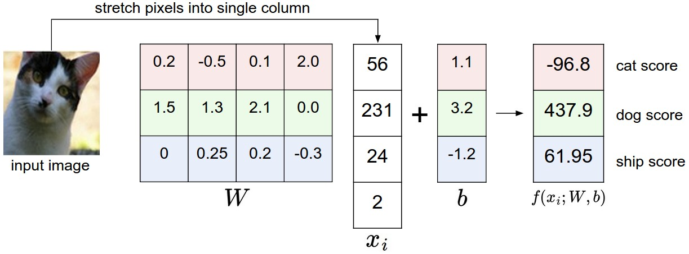

# 線形分類

前節では画像分類の問題について紹介しました。これは、固定されたカテゴリの中から画像に対して1つのラベルを割り当てるという課題です。さらに、k-近傍法（kNN）分類器について説明し、これは訓練データセットに含まれる（注釈付きの）画像と比較することで画像にラベルを付ける手法でした。ご覧のとおり、kNNにはいくつかの欠点があります。

- 分類器はすべての訓練データを記憶し、テストデータとの比較のために保存しておく必要があります。データセットは簡単にギガバイト単位のサイズになるため、これはメモリ効率が悪いです。
- テスト画像の分類には、すべての訓練画像との比較が必要となるため、計算コストが高くなります。

## 概要

ここからは、より強力な画像分類手法を開発していきます。この手法は、最終的にニューラルネットワークや畳み込みニューラルネットワークへと自然に拡張できるものです。このアプローチには2つの主要な要素があります。1つ目は、生データをクラススコアにマッピングするスコア関数であり、2つ目は、予測されたスコアと正解ラベルとの一致度を定量化する損失関数です。続いて、この問題を最適化問題として定式化し、スコア関数のパラメータに関して損失関数を最小化していきます。

## 画像からラベルスコアへのパラメータ化されたマッピング

このアプローチの最初の構成要素は、画像の画素値を各クラスに対する信頼スコアへとマッピングするスコア関数を定義することです。ここでは具体例を用いてこの手法を展開していきます。これまでと同様に、各画像 $x_i \in \mathbb{R}^D$ にラベル $y_i$ が対応づけられた訓練データセットを想定します。ここで $i = 1 \dots N$, $y_i \in \{1, \dots, K\}$ とします。つまり、$N$ 個のサンプル（各次元数 $D$）と、$K$ 種類のクラスがあるということです。

たとえば、CIFAR-10 においては、訓練セットは $N = 50,000$ 枚の画像からなり、それぞれの画像は $D = 32 \times 32 \times 3 = 3072$ の画素を持ち、$K = 10$（犬、猫、車など10種類のクラス）が存在します。ここから、生の画像画素をクラススコアへとマッピングする関数 $f: \mathbb{R}^D \rightarrow \mathbb{R}^K$ を定義します。

### 線形分類器

このモジュールでは、おそらく最も単純な関数である線形マッピングから始めます。

$$
f(x_i, W, b) =  W x_i + b
$$

上の式では、画像 $x_i$ のすべての画素が1列のベクトル（形状 [D × 1]）に平坦化されていると仮定しています。行列 $W$（サイズ [K × D]）とベクトル $b$（サイズ [K × 1]）はこの関数のパラメータです。CIFAR-10 の場合、$x_i$ は $i$ 番目の画像の全画素を1つの [3072 × 1] 列ベクトルとして含み、$W$ は [10 × 3072]、$b$ は [10 × 1] になります。つまり、関数には3072個の数値（生の画素値）が入力され、10個の数値（クラススコア）が出力されます。

$W$ のパラメータはしばしば「重み（weights）」と呼ばれ、$b$ は「バイアスベクトル（bias vector）」と呼ばれます。バイアスは実際のデータ $x_i$ に直接関わることなく出力スコアに影響を与えるためです。ただし、重みとパラメータという用語はしばしば同義に使われることがあります。

ここで注目すべき点がいくつかあります。

- まず、行列積 $W x_i$ は、実質的に10個の分類器を並列に評価していることになります（各クラスにつき1つの分類器）、ここでそれぞれの分類器は $W$ の各行に対応します。
- また、入力データ $(x_i, y_i)$ は与えられた固定のものであると考えますが、パラメータ $W$, $b$ の設定は我々が自由に調整できます。目的は、訓練データ全体において計算されたスコアが正解ラベルと一致するように、$W$ と $b$ を適切に設定することです。これをどのように達成するかについては後ほど詳しく説明しますが、直感的には「正しいクラスのスコアが、誤ったクラスのスコアよりも高くなる」ようにしたいと考えます。
- このアプローチの利点のひとつは、訓練データを用いてパラメータ $W$, $b$ を学習するものの、学習が完了すれば訓練セット全体を捨てて、学習されたパラメータだけを保持すればよい点です。なぜなら、新しいテスト画像は関数に通すだけでスコアが計算され、そのスコアに基づいて分類ができるからです。
- 最後に、テスト画像の分類は行列積と加算の1回の計算で済むため、すべての訓練画像と比較する必要がある方法に比べて、計算速度が大幅に速いという利点があります。

> 伏線： 畳み込みニューラルネットワークは、上記のように画像のピクセルをスコアに正確にマッピングするが、マッピング（f）はより複雑になり、より多くのパラメータを含むようになる。

## 線形分類器の解釈

線形分類器は、各クラスのスコアを画像の全画素値（3つのカラーチャンネルすべて）の加重和として計算します。どのような値を重みに設定するかによって、関数は画像内の特定の位置における特定の色を「好む」または「好まない」（各重みの符号に応じて）という性質を持つことができます。

たとえば、「船（ship）」クラスの場合、画像の端に青が多く存在しているとスコアが高くなると予想されます（これは水を示している可能性があります）。そのため、「船」クラスの分類器では、青チャンネルの重みに正の値が多く割り当てられており（青の存在がスコアを上げる）、逆に赤や緑チャンネルには負の重みが割り当てられている（赤や緑の存在がスコアを下げる）と期待されます。

{ loading=lazy }
/// caption
画像をクラススコアにマッピングする例です。視覚的に理解しやすくするため、ここでは画像が4つの画素（モノクロの4画素）しか持たないと仮定し、クラスは3種類（赤＝猫、緑＝犬、青＝船）とします。（補足：ここでの色は単に3つのクラスを示すものであり、RGBチャンネルとは無関係です。）

画像の画素を1列のベクトルに引き伸ばし、行列積を計算することで各クラスのスコアを得ます。ただし、この例で用いている重み行列 $W$ はあまり良いものではありません。というのも、この重みは「猫」の画像に対して非常に低い「猫」スコアを割り当てているからです。特にこの重みの組み合わせは、この画像を「犬」であると強く確信しているように見えます。
///

### 高次元の点としての画像のアナロジー

画像は高次元の列ベクトルとして引き伸ばされるため、それぞれの画像をこの空間内の1つの点として解釈できます（たとえば、CIFAR-10 の各画像は 32×32×3 画素、すなわち3072次元空間の1点として表されます）。同様に、データセット全体はラベル付きの点集合とみなすことができます。

各クラスのスコアは画像の全画素に対する加重和として定義したため、それぞれのクラススコアはこの空間における線形関数となります。3072次元の空間を視覚的に描くことはできませんが、すべての次元を2次元に押しつぶしたと仮定すれば、分類器が何をしているのかを直感的に視覚化することができます。

{ loading=lazy }
/// caption
画像空間の概念的な図では、各画像が1つの点として表され、3つの分類器が視覚化されています。ここでは「車」分類器（赤色）を例にとります。赤い線は、車クラスに対してスコアがゼロとなるすべての点を示しています。赤い矢印はスコアが増加する方向を示しており、この線の右側にある点は正のスコア（かつ線形に増加）を持ち、左側にある点は負のスコア（かつ線形に減少）を持ちます。
///

前述のとおり、$W$ の各行はそれぞれ1つのクラスに対応する分類器となっています。幾何学的に解釈すると、$W$ のある行を変更することは、画素空間内における対応する直線の向きを回転させることに相当します。一方でバイアス項 $b$ は、これらの直線を平行移動させる役割を果たします。特に、バイアス項がない場合、$x_i = 0$ を入力するとスコアは重みに関係なく常にゼロとなり、すべての直線が原点を通ることを強いられることに注意が必要です。

### 線形分類器をテンプレートマッチングとして解釈する

$W$ の各行を、それぞれのクラスに対応するテンプレート（あるいはプロトタイプ）と解釈することもできます。このとき、画像に対する各クラスのスコアは、画像と各テンプレートとの内積（ドット積）を順番に計算し、「最もよく一致するもの」を見つけることで得られます。この考え方では、線形分類器はテンプレートマッチングを行っており、そのテンプレートは学習によって得られたものです。

別の見方をすれば、これは本質的に最近傍法（Nearest Neighbor）を行っているとも言えます。ただし、訓練画像を多数使うのではなく、各クラスごとに1つのテンプレート画像だけを使い（ただしその画像は学習によって得られたものであり、訓練セット中の実際の画像とは限りません）、距離の指標として $L1$ や $L2$ 距離の代わりに（負の）内積を用いています。

{ loading=lazy }
/// caption
少し先を見てみましょう。これは、CIFAR-10 に対する学習終了時の学習済み重みの例です。たとえば「船（ship）」のテンプレートには、期待どおり多くの青い画素が含まれていることがわかります。このテンプレートは、海上の船の画像と内積を取ったときに高いスコアを与えるようになります。
///

さらに、馬のテンプレートには、左右両方を向いた馬が含まれているため、まるで頭が2つある馬のように見えることに注目してください。これは、データセット内に左向き・右向きの馬が両方含まれているためであり、線形分類器がこれら2つを1つのテンプレートに統合してしまっているのです。同様に、車の分類器も、複数のモード（前方、側面、背面から見た車や、さまざまな色）を1つのテンプレートにまとめてしまっています。特に、このテンプレートは赤くなっており、CIFAR-10 データセット内には赤い車が他の色よりも多く含まれていることを示唆しています。

線形分類器は異なる色の車をうまく識別するには力不足ですが、後ほど見るように、ニューラルネットワークであればこの課題に対処することが可能になります。少し先の話をすると、ニューラルネットワークでは隠れ層における中間ニューロンが「左向きの緑の車」「前向きの青い車」など特定のタイプの車を検出できるようになり、次の層のニューロンがこれらを重み付き和として統合し、より正確な「車」スコアを出すことが可能になります。

### バイアストリック  
先に進む前に、パラメータ $W$ と $b$ を1つにまとめて表現するための、よく使われる簡略化のトリックを紹介しておきます。スコア関数を次のように定義したことを思い出してください。

$$
f(x_i, W, b) =  W x_i + b
$$

この先の内容を進めていくうえで、2種類のパラメータ（バイアス $b$ と重み $W$）を別々に扱い続けるのはやや煩雑です。そこで、よく使われるトリックとして、$x_i$ に常に定数1を保持する追加の次元を加え、バイアス専用の次元を作ることで、$b$ と $W$ の2つのパラメータを1つの行列にまとめる方法があります。

この追加次元を導入すると、新しいスコア関数は単一の行列積として簡潔に表現できるようになります。

$$
f(x_i, W) =  W x_i
$$

CIFAR-10 の例では、$x_i$ はこれまでの [3072 × 1] ではなく、定数1を保持する追加の次元を含む [3073 × 1] のベクトルになります。そして $W$ も、それに対応して [10 × 3072] から [10 × 3073] の行列になります。$W$ の追加された最後の列は、バイアス $b$ に相当する部分です。

このようにして、バイアス項を明示的に分けずに、1つの行列に統合することができ、スコア関数は単一の行列積で記述できるようになります。以下の図を用いるとより分かりやすくなるかもしれません。

{ loading=lazy }
/// caption
バイアストリックの図解。左側では、行列積を計算した後にバイアスベクトルを加えていますが、これは右側のように、すべての入力ベクトルに定数1のバイアス次元を追加し、重み行列に1列分のバイアス列を拡張することと等価です。

このように、すべての入力ベクトルに1を付け加える前処理を行えば、学習すべきパラメータは重みとバイアスを分けて2つ扱う必要がなくなり、1つの統合された重み行列だけを学習すればよくなります。
///

### 画像データの前処理

簡単な補足ですが、上記の例では画素値の生データ（[0〜255] の範囲）を使用していました。しかし、機械学習では入力特徴量を正規化するのが非常に一般的な手法です（画像の場合、各画素が1つの特徴量とみなされます）。

特に重要なのは、各特徴量から平均を引いてデータを中心化することです。画像の場合、これは訓練画像全体の平均画像を計算し、それを各画像から引く処理に対応します。これにより、画素値はおおよそ [-127 ～ 127] の範囲に収まります。

さらに一般的な前処理としては、各特徴量の値を [-1, 1] の範囲にスケーリングする手法もあります。これらのうち、ゼロ平均の中心化は特に重要であり、その重要性については、後ほど勾配降下法の動作原理を理解するときに詳しく説明することになります。

## 損失関数

前節では、画素値からクラススコアへの関数を定義し、それが重み $W$ によってパラメータ化されていることを示しました。また、データ $(x_i, y_i)$ は固定されており我々が制御できない一方で、重みは自由に調整できること、そして訓練データの正解ラベルと整合するようにスコアが出るように重みを設定したいという点も確認しました。

たとえば、猫の画像と、それに対する「猫」「犬」「船」の各クラススコアの例を振り返ると、そのときの重みの設定は良いものではありませんでした。猫を表す画素を入力したにもかかわらず、「猫」のスコアは -96.8 と非常に低く、「犬」は 437.9、「船」は 61.95 となっていました。

このような望ましくない出力に対する「不満度合い」を測るために、**損失関数**（loss function、あるいは**コスト関数**、**目的関数**とも呼ばれます）を導入します。直感的には、訓練データの分類がうまくいっていないほど損失は大きくなり、うまく分類できているほど損失は小さくなります。

### 多クラスSupport Vector Machineの損失

損失関数の定義にはいくつかの方法がありますが、最初の例として、よく使われる損失関数である**多クラスサポートベクターマシン（SVM）損失**を導入します。SVM 損失は、各画像に対して**正しいクラスのスコアが、間違ったクラスのスコアよりも一定のマージン $\Delta$ 分だけ高くなる**ことを「望む」ように設計されています。このように、損失関数に擬人化的な説明を加えることはしばしば有益です。SVM は「ある結果を望む」のであり、それが得られたとき損失が小さくなる（つまり良い）という意味です。

では、より正確に定式化していきましょう。$i$ 番目のサンプルに対して、画像の画素 $x_i$ と、正解クラスを示すラベル $y_i$ が与えられているとします。スコア関数は $x_i$ を入力として、クラススコアのベクトル $f(x_i, W)$ を計算します。これを簡単に $s$（score の略）と表記します。たとえば、$j$ 番目のクラスのスコアは $s_j = f(x_i, W)_j$ となります。このとき、$i$ 番目の例に対する多クラス SVM 損失は次のように定式化されます：

$$
L_i = \sum_{j\neq y_i} \max(0, s_j - s_{y_i} + \Delta)
$$

#### 例

例を使ってこの仕組みを詳しく見ていきましょう。例えば、3つのクラスがあり、それぞれのスコアが $s = [13, -7, 11]$ であるとします。また、最初のクラスが正解クラス（すなわち $y_i = 0$）であると仮定します。さらに、$\Delta$（詳細は後ほど説明するハイパーパラメータ）を10とします。上記の式は、すべての誤ったクラス（$j \ne y_i$）に対して総和を取るので、2つの項が得られます。

$$
L_i = \max(0, -7 - 13 + 10) + \max(0, 11 - 13 + 10)
$$

最初の項は $[-7 - 13 + 10]$ が負の数になるため、max(0, −) 関数によりゼロに切り捨てられ、結果としてゼロになります。このペアに対する損失がゼロなのは、正解クラスのスコア（13）が誤ったクラスのスコア（-7）よりも少なくともマージン（10）だけ大きかったからです。実際には差は20であり、これは10を大きく上回っていますが、SVMはこの差が10以上であるかどうかにしか関心がなく、それ以上の差は max 関数によってゼロに抑えられます。

次の項は $[11 - 13 + 10]$ を計算し、これは8になります。つまり、正解クラスのスコア（13）は誤ったクラスのスコア（11）より高かったものの、期待されるマージン10には届いていませんでした。その差は2しかなかったため、あと8だけ差が足りない、という意味で損失が8になります。

まとめると、SVMの損失関数は、正解クラス $y_i$ のスコアが誤ったクラスのスコアよりも少なくとも $\Delta$ だけ大きいことを求めます。これが満たされない場合、その不足分に応じて損失が蓄積されます。

なお、このモジュールでは線形スコア関数（$f(x_i; W) = Wx_i$）を使用しているため、損失関数は次のように同等の形に書き換えることができます。

$$
L_i = \sum_{j\neq y_i} \max(0, w_j^T x_i - w_{y_i}^T x_i + \Delta)
$$

ここで、$w_j$ は $W$ の $j$ 行目を列ベクトルとして整形したものです。ただし、スコア関数 $f$ にもっと複雑な形式を導入し始めると、必ずしもこの形が維持されるとは限りません。

最後に、このセクションを締めくくる前に用語をもう一つ紹介しておきます。max(0,−) 関数によるゼロでのしきい値処理は、しばしば「ヒンジ損失（hinge loss）」と呼ばれます。代わりに「二乗ヒンジ損失 SVM（または L2-SVM）」を使用する人もおり、これは $\max(0, -)^2$ という形式で、マージンの違反をより強く（線形ではなく二乗的に）罰するものです。非二乗形式がより一般的ですが、データセットによっては二乗ヒンジ損失の方がうまく機能する場合もあります。どちらを使用するかは交差検証で判断されます。

> 損失関数は、トレーニングセットでの予測に対する私たちの不満度を定量化する。

{ loading=lazy }
/// caption
多クラスサポートベクターマシンは、正解クラスのスコアが他のすべてのクラスのスコアよりも少なくともマージン $\Delta$ だけ高くなることを「望んで」います。もしどれかのクラスのスコアが赤い領域内（あるいはそれ以上）に入ってしまうと、損失が発生します。そうでなければ損失はゼロになります。私たちの目標は、訓練データ内のすべての例に対してこの制約を同時に満たしつつ、合計損失ができるだけ小さくなるような重みを見つけることです。
///

#### 正則化

先ほど提示した損失関数には一つ問題があります。あるデータセットとパラメータ $W$ の組がすべての例を正しく分類できたとします（すなわち、すべてのマージンが満たされており、各 $L_i = 0$ である）。このときの問題点は、そのような $W$ が一意とは限らないということです。似たような $W$ が他にも多数存在し、どれも正しく分類できる可能性があります。

これを簡単に理解する方法として、もしある $W$ がすべての例を正しく分類していて（つまり、各例に対して損失がゼロ）、その $W$ に対して任意のスカラー倍 $\lambda W$（$\lambda > 1$）を取った場合も、すべてのスコアが一様に拡大されるため、スコア間の差も拡大され、結果的に損失は依然としてゼロになります。例えば、正解クラスと最も近い誤クラスとのスコアの差が 15 だったとすると、$W$ の各要素を 2 倍すれば、その差は 30 になります。

言い換えると、このような曖昧性を取り除くために、特定の重み $W$ を他の重みよりも優先するような仕組みを導入したいのです。それを実現する方法の一つが、損失関数に正則化項 $R(W)$ を加えることです。最も一般的な正則化項は、L2ノルムの二乗であり、すべてのパラメータに対して要素ごとの二乗ペナルティを課すことで、大きな重みの出現を抑制します。

$$
R(W) = \sum_k\sum_l W_{k,l}^2
$$

上の式では、$W$ のすべての要素の二乗を合計しています。この正則化関数はデータには依存せず、重み $W$ のみに基づいて計算される点に注意してください。正則化項を導入することで、多クラスサポートベクターマシンの完全な損失関数が完成します。この損失関数は、2つの構成要素から成ります：ひとつはデータ損失（すべての例に対する損失 $L_i$ の平均）、もうひとつは正則化損失です。すなわち、多クラスSVMの完全な損失関数は次のようになります。

$$
L =  \underbrace{ \frac{1}{N} \sum_i L_i }_\text{data loss} + \underbrace{ \lambda R(W) }_\text{regularization loss} \\\\
$$

これを完全な形で展開すると、次のようになります：

$$
L = \frac{1}{N} \sum_i \sum_{j\neq y_i} \left[ \max(0, f(x_i; W)_j - f(x_i; W)_{y_i} + \Delta) \right] + \lambda \sum_k\sum_l W_{k,l}^2
$$

ここで $N$ は訓練データの数を表します。ご覧のとおり、損失関数に正則化項を加えており、これはハイパーパラメータ $\lambda$ によって重み付けされています。

このハイパーパラメータの設定には明確な方法がなく、通常はクロスバリデーションによって決定されます。

上述の動機に加え、正則化項を導入することには多くの望ましい性質があり、それらについては後のセクションでも触れていきます。例えば、L2正則化を加えることで、SVMにおいて魅力的な「マージン最大化」の性質が得られることが知られています（詳しくはCS229の講義ノートをご参照ください）。

最も魅力的な性質は、大きな重みを罰することで汎化性能が向上しやすくなるという点です。これは、入力次元のうちどれか一つだけが極端に強い影響を与えることを防ぐからです。たとえば、入力ベクトル $\mathbf{x} = [1,1,1,1]$ に対して、重みベクトル $\mathbf{w}_1 = [1,0,0,0]$ と $\mathbf{w}_2 = [0.25,0.25,0.25,0.25]$ を考えると、どちらも内積 $\mathbf{w}^T \mathbf{x} = 1$ になります。

しかし、L2正則化項の値は $\mathbf{w}_1$ が 1.0、$\mathbf{w}_2$ が 0.25 となります。したがって、L2正則化に従うと $\mathbf{w}_2$ の方がより望ましいとされます。これは、$\mathbf{w}_2$ の重みがより小さく分散しており、特定の次元に偏らないためです。

L2正則化はこのように小さく分散した重みを好むため、最終的な分類器は少数の次元に強く依存するのではなく、すべての次元を少しずつ考慮するようになります。これにより、テスト画像に対する汎化性能が向上し、過学習が抑えられる効果が期待できます。

バイアス項は、重みとは異なり入力次元の影響力を制御しないため、同様の効果は得られません。このため、実際には重み $\mathbf{W}$ のみを正則化し、バイアス項 $\mathbf{b}$ は正則化しないのが一般的です。ただし、実際のところこの選択はほとんど効果に影響しないこともあります。最後に、正則化項を加えることにより、全ての訓練データに対して損失を完全に $0.0$ にすることは不可能になります。なぜなら、それは病的な状況である $\mathbf{W} = 0$ のときのみ実現可能だからです。

以下に、正則化なしの損失関数を Python で実装した例（非ベクトル化版および半ベクトル化版）を示します。

=== "非ベクトル化"
    ```python
    def L_i(x, y, W):
    """
    非ベクトル化バージョン。単一の例 (x, y) に対してマルチクラスSVM損失を計算します。
    - x は画像を表す列ベクトル（例：CIFAR-10 では 3073 x 1）で、
        バイアス項として3073番目の次元が追加されています（いわゆるバイアストリック）。
    - y は正解クラスのインデックスを表す整数（例：CIFAR-10 では 0〜9）。
    - W は重み行列（例：CIFAR-10 では 10 x 3073）。
    """
    delta = 1.0  # マージンのしきい値（このセクション後半で説明あり）
    scores = W.dot(x)  # 各クラスのスコアを計算（サイズは 10 x 1）
    correct_class_score = scores[y]  # 正解クラスのスコア
    D = W.shape[0]  # クラス数（例：10）
    loss_i = 0.0
    for j in range(D):  # 全てのクラスに対してループ
        if j == y:
        # 正解クラスはスキップし、誤ったクラスのみを対象とする
        continue
        # i番目の訓練例に対する損失を累積
        loss_i += max(0, scores[j] - correct_class_score + delta)
    return loss_i
    ```
=== "半ベクトル化"
    ```python
    def L_i_vectorized(x, y, W):
    """
    より高速な半ベクトル化バージョン。半ベクトル化とは、
    単一の訓練例に対して for ループを使用せずに実装していることを意味します。
    （ただし、全体のループはこの関数の外で行われます）
    """
    delta = 1.0
    scores = W.dot(x)  # 各クラスのスコアを計算（サイズは 10 x 1）
    # 全クラスに対してマージンをベクトル演算で一括計算
    margins = np.maximum(0, scores - scores[y] + delta)
    # 正解クラスに対応する位置ではスコア差がキャンセルされ delta となるが、
    # ここでは正解クラスのマージンを無視したいため 0 に設定
    margins[y] = 0
    loss_i = np.sum(margins)  # マージンの総和を損失とする
    return loss_i
    ```
=== "完全ベクトル化"
    ```python
    def L(X, y, W):
    """
    完全ベクトル化された実装：
    - X は全ての訓練データを列方向に保持する行列（例：CIFAR-10では 3073 x 50,000）
    - y は正解クラスを指定する整数配列（例：長さ50,000の配列）
    - W は重み行列（例：10 x 3073）

    全ての訓練例に対する損失を for ループを使わずに計算します。
    """
    delta = 1.0
    scores = W.dot(X)  # スコア行列（10 x N）
    correct_class_scores = scores[y, np.arange(X.shape[1])]  # 正解クラスのスコア（1 x N）
    margins = np.maximum(0, scores - correct_class_scores + delta)  # マージン計算（10 x N）
    margins[y, np.arange(X.shape[1])] = 0  # 正解クラスのマージンは無視
    loss = np.sum(margins)  # 全訓練例の損失を合計
    return loss
    ```

このセクションの要点は、SVM損失が、訓練データに対する予測が正解ラベルとどれだけ一致しているかを測る一つの方法であるということです。加えて、訓練データに対して良い予測を行うことは、損失を最小化することと同義になります。

> あとは、損失を最小にする重みを見つける方法を考え出すだけだ。

## 実践的な考察

### デルタの設定

ここではハイパーパラメータ $\Delta$ とその設定について簡単に触れました。では、この値をいくつに設定すべきで、クロスバリデーションによって調整する必要があるのでしょうか？実は、このハイパーパラメータは常に $\Delta = 1.0$ に設定して問題ありません。$\Delta$ と $\lambda$ は異なるハイパーパラメータのように見えますが、実際にはどちらも同じトレードオフ、すなわち「データ損失」と「正則化損失」とのバランスを制御しています。

この関係を理解する鍵は、重み行列 $W$ の大きさがスコア（およびその差）に直接影響を与えるという点です。$W$ の全ての値を縮小すればスコア差も小さくなり、逆に拡大すればスコア差は大きくなります。したがって、スコア間のマージン（たとえば $\Delta=1$ や $\Delta=100$）の具体的な値は、ある意味で無意味です。なぜなら、重みを調整することでスコア差は自由に縮小・拡大できるからです。したがって、唯一重要なトレードオフは、正則化強度 $\lambda$ を通じて重みの大きさをどこまで許容するか、という点にあります。

### 二値SVMとの関係

この講義に参加している皆さんの中には、二値（バイナリ）のサポートベクターマシン（SVM）に関する経験がある方もいるかもしれません。バイナリSVMでは、$i$ 番目の例に対する損失は以下のように表されます：  

$$
L_i = C \max(0, 1 - y_i w^Tx_i) + R(W)
$$

ここで $C$ はハイパーパラメータであり、$y_i \in \{-1, 1\}$ です。このセクションで示した定式化は、クラス数が2つだけの場合にはバイナリSVMを特殊なケースとして含んでいることが確認できます。つまり、もしクラスが2つしかなければ、損失関数は上で示されたバイナリSVMの形に帰着します。

また、このバイナリSVMにおけるハイパーパラメータ $C$ と、我々の定式化における $\lambda$ は同じトレードオフ、すなわちデータ損失と正則化損失のバランスを制御しており、互いに反比例の関係（$C \propto \frac{1}{\lambda}$）にあります。

### 補足：原始的な最適化について

この授業にSVMの知識を持って臨んでいる方は、カーネルや双対形式、SMOアルゴリズムなどについても聞いたことがあるかもしれません。この授業（および一般的なニューラルネットワークの文脈）では、最適化目的は常に制約のない一次形式（primal form）で扱います。これらの目的関数の多くは、技術的には微分不可能です（例えば、$max(x, y)$ 関数は $x=y$ のときに折れ曲がりがあるため微分できません）が、実際にはこれは問題にならず、劣勾配（subgradient）を使うのが一般的です。

### 補足：他の多クラスSVMの定式化

このセクションで紹介する多クラスSVMは、SVMを複数クラスに拡張する方法の一つにすぎません。よく使われる別の形式としては、One-Vs-All（OVA）SVMがあり、これは各クラスとその他すべてのクラスを区別するバイナリSVMを個別に学習する方法です。関連するが実際にはあまり使われない方法としては、All-Vs-All（AVA）戦略もあります。

本授業の定式化は、[Weston and Watkins 1999（pdf）](https://www.elen.ucl.ac.be/Proceedings/esann/esannpdf/es1999-461.pdf)に基づくもので、OVAよりも強力なバージョンです（つまり、この方法ではデータ損失がゼロになる多クラスデータセットを構築できるのに対し、OVAではできない場合があります。興味があれば論文をご覧ください）。

最後に、Structured SVMという定式化もあり、これは正解クラスのスコアと最も高い誤クラスのスコアとの間のマージンを最大化します。これらの違いを詳細に理解することは本授業の範囲外ですが、ここで紹介するバージョンは実際の使用において安全な選択肢といえます。

ただし、最もシンプルといえるOVA戦略でも十分に機能する可能性が高く（Rikinらによる2004年の論文「[In Defense of One-Vs-All Classification（pdf）](http://www.jmlr.org/papers/volume5/rifkin04a/rifkin04a.pdf)」でもその点が議論されています）、実用上はそれで問題ないことも多いです。

## Softmax分類器

SVMはよく使われる2種類の分類器のうちの1つであり、もう一方の代表的な選択肢がSoftmax分類器です。Softmax分類器は異なる損失関数を持っています。バイナリのロジスティック回帰分類器を聞いたことがある方にとっては、Softmax分類器はそれを多クラスに一般化したものです。SVMでは出力 $f(x_i, W)$ を各クラスに対するスコア（未調整かつ解釈が難しい可能性のある値）として扱うのに対し、Softmax分類器はより直感的な出力（正規化されたクラス確率）を提供し、さらに確率的な解釈も可能である点が特徴です。Softmax分類器においては、写像関数 $f(x_i; W) = W x_i$ 自体は変わりませんが、これらのスコアを各クラスの非正規化対数確率として解釈し、ヒンジ損失の代わりに**クロスエントロピー損失**を用います。クロスエントロピー損失の形式は次のとおりです：

$$
L_i = -\log\left(\frac{e^{f_{y_i}}}{ \sum_j e^{f_j} }\right) \hspace{0.5in} \text{or equivalently} \hspace{0.5in} L_i = -f_{y_i} + \log\sum_j e^{f_j}
$$

ここで、$f_j$ はクラススコアベクトル $f$ の $j$ 番目の要素を意味する記法です。先ほどと同様に、データセット全体の損失はすべての訓練データに対する $L_i$ の平均に、正則化項 $R(W)$ を加えたものです。関数 $f_j(z) = \frac{e^{z_j}}{\sum_k e^{z_k}}$ はソフトマックス関数と呼ばれます。これは実数値の任意のスコアベクトル $z$ を、すべての要素が0以上1以下で、合計が1になるように変換します。ソフトマックス関数を含む完全なクロスエントロピー損失は、初めて見ると複雑に見えるかもしれませんが、その動機づけは比較的簡単です。

情報理論的な観点。ある「真の」分布 $p$ と、推定された分布 $q$ の間のクロスエントロピーは次のように定義されます：

$$
H(p,q) = - \sum_x p(x) \log q(x)
$$

したがって、Softmax分類器は、推定されたクラス確率（すなわち、$q = \frac{e^{f_{y_i}}}{\sum_j e^{f_j}}$）と「真の」分布との間のクロスエントロピーを最小化しています。ここでの「真の」分布とは、すべての確率質量が正解クラスに集中している分布（つまり、$p = [0, \dots, 1, \dots, 0]$ のように、$y_i$ 番目に 1 を持つもの）です。

さらに、クロスエントロピーはエントロピーとカルバック・ライブラー（KL）ダイバージェンスを用いて $H(p, q) = H(p) + D_{KL}(p || q)$ と表すことができ、デルタ関数である $p$ のエントロピー $H(p)$ はゼロであるため、これは2つの分布間のKLダイバージェンス（距離の一種）を最小化することと同等です。言い換えれば、クロスエントロピーの目的は、予測された分布が正解クラスにすべての確率質量を持つようにすることです。

### 確率的解釈

式を見ると

$$
P(y_i \mid x_i; W) = \frac{e^{f_{y_i}}}{\sum_j e^{f_j} }
$$

画像 $x_i$ とパラメータ $W$ が与えられたときに、正しいラベル $y_i$ に割り当てられた（正規化された）確率として解釈できます。このことを理解するには、Softmax分類器では出力ベクトル $f$ 内のスコアを未正規化の対数確率と解釈していることを思い出してください。これらを指数関数で変換することで（未正規化の）確率が得られ、分母で正規化することで、確率の総和が1になるよう調整されます。

したがって確率的な解釈では、私たちは正しいクラスの負の対数尤度（negative log likelihood）を最小化しており、これは最尤推定（Maximum Likelihood Estimation, MLE）を行っていると捉えることができます。この観点の優れた点として、損失関数に含まれる正則化項 $R(W)$ を、重み行列 $W$ に対するガウス事前分布に由来するものと解釈できる点があります。つまり、最尤推定ではなく*最尤事後推定*（Maximum a posteriori estimation, MAP）を行っていると見ることもできます。これらの解釈は直感を助けるために紹介していますが、その詳細な導出は本授業の範囲外とします。

### 現実的な問題：数値の安定性

実際にSoftmax関数を計算するコードを書く際には、中間項である $e^{f_{y_i}}$ や $\sum_j e^{f_j}$ が指数関数により非常に大きな値になる可能性があり、これらの大きな数の除算は数値的に不安定になることがあります。したがって、正規化の工夫を行うことが重要です。

例えば、分子と分母の両方に定数 $C$ を掛けて、その定数を分母の総和の中に取り込むと、次のような（数学的に同値な）式が得られます：

$$
\frac{e^{f_{y_i}}}{\sum_j e^{f_j}}
= \frac{Ce^{f_{y_i}}}{C\sum_j e^{f_j}}
= \frac{e^{f_{y_i} + \log C}}{\sum_j e^{f_j + \log C}}
$$

$C$ の値は自由に選ぶことができ、結果には影響を与えませんが、この値をうまく選ぶことで計算の数値的安定性を高めることができます。よく使われる方法として、$\log C = -\max_j f_j$ と設定することがあります。これは、ベクトル $f$ 内の値を全体的にシフトして、最大値を0にするということです。コードでは次のように書けます：

```python
f = np.array([123, 456, 789])  # 3クラスのスコアが非常に大きい例
p = np.exp(f) / np.sum(np.exp(f))  # 悪い例：数値的に不安定で、オーバーフローの可能性あり

# 代わりに：f の値をシフトして、最大値が 0 になるようにする：
f -= np.max(f)  # f は [-666, -333, 0] となる
p = np.exp(f) / np.sum(np.exp(f))  # 安全に計算でき、正しい確率が得られる
```

### 命名規則が混乱する可能性

正確に言えば、SVM分類器はヒンジ損失（またはマージン最大化損失）を使用し、Softmax分類器はクロスエントロピー損失を使用します。Softmax分類器という名前は、ソフトマックス関数に由来しており、この関数は生のクラススコアを、合計が1になるような正規化された正の値に変換するために用いられます。これによってクロスエントロピー損失を適用することが可能になります。

特に注意すべき点として、*「ソフトマックス損失」*という表現は技術的には正確ではありません。なぜなら、softmax はあくまで変換関数であり、損失関数ではないからです。ただし、実際にはこの表現はよく使われる省略形でもあります。

## SVM vs. Softmax

図を使うと、Softmax分類器とSVM分類器の違いがより分かりやすくなります。

{ loading=lazy }
/// caption
1つのデータ点を例にとったSVM分類器とSoftmax分類器の違い。どちらの場合も、まず同じスコアベクトル $f$ を計算します（例えば行列積によって）。違いは、このスコア $f$ の解釈にあります。

SVMでは、$f$ をクラススコアと解釈し、損失関数は正解クラス（ここではクラス2、青色）が他のクラスよりも一定のマージンをもって高いスコアを取るように促します。一方、Softmax分類器では $f$ を各クラスの（未正規化の）対数確率と解釈し、それを正規化して、正解クラスの（正規化された）対数確率が高くなるように（つまりその負の値が小さくなるように）損失関数が設計されています。

この例での最終的な損失は、SVMで1.58、Softmax分類器で1.04となります（なお、1.04は自然対数で計算された値です。底2や底10ではありません）。ただし、これらの数値は相互に比較できるものではなく、同じ分類器・同じデータ内でのみ意味を持ちます。
///

### ソフトマックス分類器は各クラスに「確率」を与える

SVMは全クラスに対して未調整で解釈が難しいスコアを出力するのに対し、Softmax分類器はすべてのラベルに対する「確率」を計算できるという利点があります。例えば、ある画像に対してSVM分類器がクラス “cat”, “dog”, “ship” に対して [12.5, 0.6, -23.0] というスコアを出すとします。一方で、Softmax分類器はこれらのラベルに対して [0.9, 0.09, 0.01] のような確率を出力でき、各クラスに対する信頼度を解釈することが可能になります。

ただし、「確率」という言葉を引用符でくくっているのは、これらの確率がどれだけ尖っているか（鋭いピークを持つか）あるいは広がっているか（分散しているか）は、正則化強度 $\lambda$ に大きく依存するためです。この $\lambda$ はユーザーがシステムへの入力として設定するものです。

例えば、ある3クラスに対する未正規化の対数確率が [1, -2, 0] であるとしましょう。このとき、Softmax関数は次のように計算されます：

$$
[1, -2, 0] \rightarrow [e^1, e^{-2}, e^0] = [2.71, 0.14, 1] \rightarrow [0.7, 0.04, 0.26]
$$

この計算では、各スコアに指数関数を適用し、それらを正規化して合計が1になるように調整します。さて、もし正則化強度 $\lambda$ を大きくすると、重み $W$ に対するペナルティが強くなり、その結果、重みの値がより小さくなります。

例えば、先ほどの未正規化対数確率が [1, -2, 0] だったときに、$\lambda$ を大きくしたことで重みが半分になり、新たなスコアが [0.5, -1, 0] になったとしましょう。このとき、Softmax関数は次のように計算されます：

$$
[0.5, -1, 0] \rightarrow [e^{0.5}, e^{-1}, e^0] = [1.65, 0.37, 1] \rightarrow [0.55, 0.12, 0.33]
$$

このとき、確率は以前よりも分散した（拡がった）形になります。さらに、正則化強度 $\lambda$ を非常に大きくして重みが極めて小さくなる極限では、出力される確率はほぼ一様分布に近づきます。

したがって、Softmax分類器が算出する確率は、厳密な意味での「確率」というよりも「信頼度」として捉える方が適切です。SVMと同様に、スコアの順序には意味がありますが、スコアの絶対値やその差分には厳密な意味での解釈性はないという点に注意が必要です。

### 実際にはSVMとSoftmaxは同等である

SVMとSoftmax分類器の性能差は通常ごくわずかであり、どちらが優れているかについては人によって意見が分かれます。Softmax分類器と比べて、SVMはより「局所的」な目的関数を持っており、これはバグとも特徴とも解釈できます。

たとえば、スコアが [10, -2, 3] で、最初のクラスが正解だとします。SVM（例えばマージン $\Delta = 1$ を仮定）では、正解クラスが他のすべてのクラスよりマージン分高ければ、損失はゼロになります。つまり、スコアの詳細には関心がなく、たとえそれが [10, -100, -100] でも [10, 9, 9] でも、マージンさえ満たされていれば同じく損失はゼロです。

一方で、Softmax分類器にとってはこのようなシナリオは等価ではありません。Softmaxでは [10, 9, 9] のようなスコアに対しては、誤クラスのスコアが高いため損失が大きくなりますが、[10, -100, -100] のような場合は損失がかなり小さくなります。つまり、Softmax分類器は出力されたスコアに常に完全には満足せず、正解クラスの確率がもっと高くなることや、誤クラスの確率がもっと低くなることを常に望んでおり、それに応じて損失を減らそうとします。

対照的に、SVMは一度マージンが満たされると、それ以上スコアに細かく介入することはありません。この性質は直感的に「特徴」とも捉えることができます。たとえば、自動車を分類する分類器が「自動車」と「トラック」の判別という難しい問題に主に労力を注ぐべきである場合、「カエル」のようにすでに低いスコアが割り当てられており、データ空間の全く異なる領域に存在する例にまで注意を払う必要はない、という考え方です。

### インタラクティブデモ

[{ loading=lazy }](http://vision.stanford.edu/teaching/cs231n/linear-classify-demo)
/// caption
線形分類器に対する直感を深めるために、インタラクティブなWebデモを用意しています。このデモでは、本セクションで紹介した損失関数を、2次元データに対する3クラス分類のシンプルな例を使って可視化しています。また、このデモでは少し先の内容として最適化の処理も実行していますが、その詳細については次のセクションで詳しく説明します。

訳注：翻訳時点(2025年4月)では、このデモへの[リンク](http://vision.stanford.edu/teaching/cs231n/linear-classify-demo)は失効しています。
///

## まとめ

本セクションでは以下の内容を扱いました：

- 画像のピクセルからクラススコアへのスコア関数を定義しました（このセクションでは、重み $W$ とバイアス $b$ に依存する線形関数）。
- k近傍法（kNN）分類器とは異なり、この**パラメトリックなアプローチ**の利点は、一度パラメータを学習すれば訓練データを捨てることができる点です。また、新しいテスト画像に対する予測は、$W$ との1回の行列積で済むため高速です。全訓練データとの比較を行う必要はありません。
- **バイアストリック**を紹介しました。これにより、バイアスベクトルを重み行列に統合することができ、1つのパラメータ行列のみを扱えばよくなります。
- **損失関数**を定義しました（線形分類器で一般的に使われる**SVM**損失と**Softmax**損失の2種類を紹介）。この損失関数は、あるパラメータ設定が訓練データの正解ラベルとどれだけ整合的かを測る指標です。また、訓練データでの予測が良好であることと、損失が小さいことが等価になるように設計されている点も確認しました。

ここまでで、画像データセットを用いて各画像をパラメータに基づいてクラススコアにマッピングする方法を学び、その予測の質を評価するための損失関数の例として、2つの代表的な手法（SVM損失とSoftmax損失）を見てきました。しかし、どのようにすれば最も良い（すなわち損失が最も小さい）パラメータを効率的に見つけることができるのでしょうか？
  
このプロセスが「最適化」と呼ばれるものであり、次のセクションの主なテーマとなります。

## 参考資料

以下は、さらなる学習のための興味深い（任意の）参考リンクです：

- Charlie Tang氏による「[Deep Learning using Linear Support Vector Machines](https://arxiv.org/abs/1306.0239)」（2013年）は、L2SVMがSoftmaxを上回るという結果を示している。
