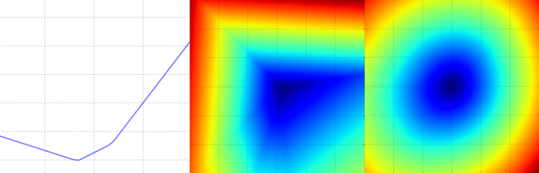
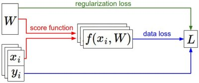

# 最適化

## 導入

前回のセクションでは、画像分類タスクの文脈において重要な 2 つの要素を紹介しました：

1. 生の画像ピクセルをクラススコアに写像する（パラメータ付きの）**スコア関数**（例：線形関数）
2. 特定のパラメータ集合が、トレーニングデータの正解ラベルとどれだけ一致しているかを評価する**損失関数**

具体的には、線形関数は $f(x_i, W) = W x_i$ という形であり、我々が構築した SVM は以下のように定式化されました：

$$
L = \frac{1}{N} \sum_i \sum_{j\neq y_i} \left[ \max(0, f(x_i; W)_j - f(x_i; W)_{y_i} + 1) \right] + \alpha R(W)
$$

ここで、正解ラベルと一致する予測を行うようなパラメータ $W$ の設定では、損失 $L$ は非常に小さくなることがわかりました。そして今回は、3 つ目で最後の重要な要素である**最適化**について説明します。最適化とは、損失関数を最小化するパラメータ $W$ を見つけるプロセスです。

**予告：** この 3 つの要素の関係性を理解した後、最初の要素であるパラメータ付き関数をより複雑な関数（ニューラルネットワークや CNN）へと拡張していきます。その際、損失関数と最適化プロセスは比較的変わりません。

## 損失関数の可視化

この講義で扱う損失関数は、通常非常に高次元の空間上で定義されています（例：CIFAR-10 における線形分類器の重み行列は [10 x 3073] のサイズで、合計 30,730 個のパラメータがあります）。このため、損失関数を可視化することは困難です。しかし、高次元空間内を 1 次元の「線」または 2 次元の「平面」に沿って切り取ることで、ある程度の直感を得ることができます。

たとえば、ランダムな重み行列 $W$（空間内の 1 点）を生成し、その方向に沿って進みながら損失関数の値を記録することができます。具体的には、ランダムな方向 $W_1$ を生成し、様々な値の $a$ に対して $L(W + a W_1)$ を評価します。この処理により、x 軸が $a$、y 軸が損失関数の値となる単純なプロットが得られます。

同様に、2 つの方向 $W_1, W_2$ を使って $L(W + a W_1 + b W_2)$ を評価し、x 軸と y 軸をそれぞれ $a, b$ に対応させ、損失関数の値を色で示す可視化も可能です。

{ loading=lazy }
/// caption
CIFAR-10 におけるマルチクラス SVM の損失関数地形（正則化なし）を示しています。左と中央は 1 つのサンプル、右は 100 個のサンプルに対する損失です。

左：パラメータ$a$のみを変化させた 1 次元損失。
中央・右：2 次元の損失断面。青は損失が低く、赤は損失が高いことを示しています。

損失関数の形状は**区分線形的**であることに注目してください。複数のサンプルに対する損失は平均して求められるため、右図の「ボウル型」の形状は、中央図のような複数の区分線形な損失地形の平均になっています。
///

単一の例に対する損失は以下のように表されます：

$$
L_i = \sum_{j\neq y_i} \left[ \max(0, w_j^Tx_i - w_{y_i}^Tx_i + 1) \right]
$$

この式から明らかなように、各サンプルに対するデータ損失は、$W$に対して線形な関数の和であり、さらにそれぞれが$max(0, \cdot)$によってゼロで閾値処理された形になっています。加えて、$W$の各行（すなわち各クラス重み$w\_j$）は、あるときには誤ったクラスに対して正の符号で、またあるときには正しいクラスに対して負の符号で現れます。

この点をより明確にするために、以下のような簡単なデータセットを考えてみましょう。これは 1 次元のデータ点が 3 つ、クラスが 3 つある場合です。このときの SVM の完全な損失関数（正則化なし）は次のようになります：

$$
\begin{align}
L_0 = & \max(0, w_1^Tx_0 - w_0^Tx_0 + 1) + \max(0, w_2^Tx_0 - w_0^Tx_0 + 1) \\\\
L_1 = & \max(0, w_0^Tx_1 - w_1^Tx_1 + 1) + \max(0, w_2^Tx_1 - w_1^Tx_1 + 1) \\\\
L_2 = & \max(0, w_0^Tx_2 - w_2^Tx_2 + 1) + \max(0, w_1^Tx_2 - w_2^Tx_2 + 1) \\\\
L = & (L_0 + L_1 + L_2)/3
\end{align}
$$

これらの例は 1 次元なので、データ $x_i$ と重み $w_j$ は数値です。例えば$w_0$ を見ると、上のいくつかの項は $w_0$ の一次関数であり、それぞれゼロでクランプされています。これを視覚化すると次のようになります。

{ loading=lazy }
/// caption
データ損失の 1 次元の図示。x 軸は 1 つの重みを、y 軸は損失を表しています。データ損失は複数の項の合計で構成されており、それぞれの項は、ある特定の重みに依存しないか、またはその重みに対する 0 でしきい値処理された線形関数のいずれかです。完全な SVM のデータ損失は、この形状の 30,730 次元バージョンです。
///

ちなみに、損失関数がお椀のような形をしていることから、SVM のコスト関数が[凸関数](https://ja.wikipedia.org/wiki/%E5%87%B8%E9%96%A2%E6%95%B0)の一例であることにお気づきかもしれません。凸関数の効率的な最小化に関する文献は非常に多く存在しており、このテーマに特化したスタンフォード大学の講義（[Convex Optimization](https://stanford.edu/~boyd/cvxbook/)）もあります。

しかし、スコア関数 $f$ をニューラルネットワークに拡張すると、目的関数は非凸関数となり、上記のような「お椀型」の図ではなく、複雑で凸凹した地形のような可視化になります。

_非微分可能な損失関数についての技術的な注意点_：max 演算によって損失関数に折れ目（kinks）が生じるため、理論的にはその箇所で勾配が定義されず、損失関数は微分可能ではないことになります。しかし、そうした点においても[サブグラディエント（劣勾配）](https://ja.wikipedia.org/wiki/%E5%8A%A3%E5%BE%AE%E5%88%86)は存在し、代わりに広く利用されます。この講義では、サブグラディエントと勾配という用語は同じ意味として扱います。

## 最適化

繰り返しになりますが、損失関数は、ある特定の重み $W$ のセットの質を定量的に評価するためのものです。最適化の目標は、この損失関数を最小化するような $W$ を見つけることです。

これから、損失関数を最適化するためのアプローチについて、その動機づけを行い、少しずつ展開していきます。すでに前提知識のある方にとっては、ここで扱う例題（SVM の損失関数）が凸問題であるため、少し違和感を覚えるかもしれません。しかし、忘れてはならないのは、最終的な目標はニューラルネットワークの最適化であり、そこでは凸最適化の文献で開発されたツールを簡単に適用することができないという点です。

### 戦略その１：ランダム検索（最初の非常に悪いアイディア）

ある重みのセット $W$ がどれだけ良いかを評価するのは非常に簡単なので、最初に思いつく（しかし非常に悪い）アイデアは、**たくさんのランダムな重みを試して、その中で最も良いものを記録する**という方法です。この手法は次のようなものになります：

```python
"""
X_train はデータ（各列が1つのサンプル、例：3073 × 50,000）であり、
Y_train はラベル（例：1次元配列で50,000要素）とする。
また、関数 L は損失関数を評価する。
"""
bestloss = float("inf")  # Pythonでは無限大の初期値を設定
for num in range(1000):
  W = np.random.randn(10, 3073) * 0.0001  # 小さな値で初期化されたランダムな重みを生成
  loss = L(X_train, Y_train, W)  # トレーニングセット全体に対する損失を計算
  if loss < bestloss:  # 最良の損失値を記録
    bestloss = loss
    bestW = W
  print('in attempt %d the loss was %f, best %f' % (num, loss, bestloss))

# 出力:
# in attempt 0 the loss was 9.401632, best 9.401632
# in attempt 1 the loss was 8.959668, best 8.959668
# in attempt 2 the loss was 9.044034, best 8.959668
# in attempt 3 the loss was 9.278948, best 8.959668
# in attempt 4 the loss was 8.857370, best 8.857370
# in attempt 5 the loss was 8.943151, best 8.857370
# in attempt 6 the loss was 8.605604, best 8.605604
# ... (1000行続く)
```

上のコードでは、いくつかのランダムな重みベクトル $W$ を試し、その中には他よりも良い結果を出すものがあることが分かりました。この探索によって見つかった最良の重み $W$ を使って、テストセットで試してみることができます。

```python
# X_testは[3073 x 10000]、Y_testは[10000 x 1]と仮定
scores = Wbest.dot(Xte_cols)  # 10 x 10000、すべてのテストサンプルに対するクラススコアを計算
Yte_predict = np.argmax(scores, axis=0)  # 各列の最大スコアのインデックス（予測されたクラス）を取得
np.mean(Yte_predict == Yte)  # 正解率（予測が正しかった割合）を計算
# 結果：0.1555 を返す
```

最良の $W$ を用いた場合、精度は約 15.5%となります。完全にランダムにクラスを予測した場合の精度がわずか 10%であることを考えると、これは極めて単純なランダム探索による解法としては、決して悪い結果ではありません

#### 核心となる考え方：反復的洗練

もちろん、私たちはもっと良い結果を得られる可能性があります。核心となる考え方は、最適な重みの集合 $W$ を見つけることは非常に難しく、場合によっては不可能であるということです（特に $W$ に複雑なニューラルネットワーク全体の重みが含まれている場合）。しかし、特定の重み $W$ を少しだけ改善する問題は、それほど難しくありません。言い換えれば、私たちのアプローチはランダムな $W$ から始めて、それを繰り返し少しずつ改善していくというものです。

> 私たちの戦略は、ランダムな重みで開始し、より低い損失を得るために時間をかけて反復的に改良することである。

#### 目隠しをしたハイカーに例えて

今後の理解に役立つかもしれないたとえとして、目隠しをして丘陵地帯をハイキングしている自分を想像するとよいでしょう。そして、その目的は谷底にたどり着くことです。CIFAR-10 の例では、丘の地形は 30,730 次元になっています。というのも、$W$ の次元は $10 \times 3073$ だからです。丘のどの地点にいても、ある特定の損失（地形の高さ）を得ることになります。

### 戦略その２：ランダムローカル探索

最初に思いつく戦略は、足をランダムな方向に一歩伸ばしてみて、もしそれが下り坂につながっているならその方向に進むという方法です。具体的には、ランダムな $W$ から始めて、それに対するランダムな摂動 $\delta W$ を生成し、摂動後の $W + \delta W$ における損失が低ければ更新を行うという手順です。この手続きを実装するコードは以下のとおりです。

```python
W = np.random.randn(10, 3073) * 0.001 # ランダムな初期Wを生成
bestloss = float("inf")
for i in range(1000):
  step_size = 0.0001
  Wtry = W + np.random.randn(10, 3073) * step_size
  loss = L(Xtr_cols, Ytr, Wtry)
  if loss < bestloss:
    W = Wtry
    bestloss = loss
  print('iter %d loss is %f' % (i, bestloss))
```

先ほどと同じ回数（1000 回）の損失関数評価を用いた場合、このアプローチではテストセットにおける分類精度が 21.4% に達します。これは改善ではあるものの、依然として無駄が多く、計算コストも高い方法です。

### 戦略その３：勾配に従う

前のセクションでは、重み空間において損失を下げるような方向を見つけようとしました。しかし、良い方向をランダムに探す必要はなく、数学的に最も急降下する方向を計算することが可能であることが分かっています（ステップサイズがゼロに近づく極限において）。この最も急な下り坂の方向は、損失関数の勾配に関係しています。

ハイキングのたとえで言えば、これは足元の斜面を手で感じて、最も急に下っている方向へ進むような方法です。

一次元関数において、傾きとはある点における関数の瞬間的な変化率です。勾配（グラディエント）は、この概念を多次元関数に一般化したもので、1 つの数値ではなくベクトルを入力とする関数に対して定義されます。勾配とは、入力空間の各次元に対する傾き（一般には**導関数**と呼ばれます）を成分にもつベクトルのことです。一次元関数の入力に対する導関数の数学的表現は次のとおりです。

$$
\frac{df(x)}{dx} = \lim_{h\ \to 0} \frac{f(x + h) - f(x)}{h}
$$

対象とする関数が単一の数値ではなく数値のベクトルを入力として取る場合、これらの導関数は**偏微分**と呼ばれます。そして、勾配とは各次元における偏微分を集めたベクトルにほかなりません。

## 勾配を計算する

勾配を計算する方法には 2 つあります。1 つは遅くて近似的ですが簡単な方法（**数値的勾配**）であり、もう 1 つは速くて正確ですが計算ミスが起こりやすく、微分計算を必要とする方法（**解析的勾配**）です。ここでは、これら両方の方法を紹介します。

### 有限差分による勾配の数値計算

上記の式を用いることで、勾配を数値的に計算することができます。以下は、関数 $f$、その勾配を評価したいベクトル $x$ を受け取り、$x$ における $f$ の勾配を返す汎用的な関数です。

```python
def eval_numerical_gradient(f, x):
  """
  f の数値的勾配を x において評価する素朴な実装
  - f は1つの引数を取る関数である必要がある
  - x は勾配を評価する点（NumPy 配列）
  """

  fx = f(x)  # 元の点における関数値を評価
  grad = np.zeros(x.shape)
  h = 0.00001

  # x のすべてのインデックスを反復処理
  it = np.nditer(x, flags=['multi_index'], op_flags=['readwrite'])
  while not it.finished:

    # x+h における関数を評価
    ix = it.multi_index
    old_value = x[ix]
    x[ix] = old_value + h # h だけ増加
    fxh = f(x) # f(x + h) を評価
    x[ix] = old_value # 元の値に戻す（非常に重要！）

    # 偏微分を計算
    grad[ix] = (fxh - fx) / h # 傾きを計算
    it.iternext() # 次の次元へ進む

  return grad
```

上記の勾配の式に従って、このコードはすべての次元を一つずつ反復し、その次元に沿って小さな変化 $h$ を加え、関数がどれだけ変化したかを見ることで損失関数のその次元における偏微分を計算します。最終的に、変数`grad`は完全な勾配ベクトルを保持します。

#### 実用的な観点

数学的には勾配は $h \to 0$ の極限で定義されますが、実際には非常に小さな値（例として $1\mathrm{e}{-5}$）を使えば十分な精度が得られることが多いです。理想的には、数値的不安定性を引き起こさない範囲で、できるだけ小さいステップサイズを選ぶのが望ましいです。

さらに、実際には中心差分の公式（$[f(x+h) - f(x-h)] / 2h$）を用いて数値勾配を計算する方が精度よく動作することが多いです。詳しくは[Wiki](https://en.wikipedia.org/wiki/Numerical_differentiation)などを参照してください。

上で定義した関数を使えば、任意の点および任意の関数に対して勾配を計算することができます。では、CIFAR-10 の損失関数について、重み空間上のランダムな点で勾配を計算してみましょう。

```python
# 上記の汎用コードを使うには、1つの引数（この場合は重み）を取る関数が必要。
# そのため、X_train と Y_train をクロージャで囲む。
def CIFAR10_loss_fun(W):
  return L(X_train, Y_train, W)

W = np.random.rand(10, 3073) * 0.001  # ランダムな重みベクトルを初期化
df = eval_numerical_gradient(CIFAR10_loss_fun, W)  # 勾配を計算
```

勾配は、損失関数が各次元に沿ってどのように変化するか（傾き）を示しており、これを使って重みの更新を行うことができます。

```python
loss_original = CIFAR10_loss_fun(W)  # 元の損失を計算
print 'original loss: %f' % (loss_original, )

# 複数のステップサイズでの効果を確認
for step_size_log in [-10, -9, -8, -7, -6, -5, -4, -3, -2, -1]:
  step_size = 10 ** step_size_log
  W_new = W - step_size * df  # 重み空間上の新しい位置
  loss_new = CIFAR10_loss_fun(W_new)
  print('for step size %f new loss: %f' % (step_size, loss_new))

# 出力結果の例:
# original loss: 2.200718
# for step size 1.000000e-10 new loss: 2.200652
# for step size 1.000000e-09 new loss: 2.200057
# for step size 1.000000e-08 new loss: 2.194116
# for step size 1.000000e-07 new loss: 2.135493
# for step size 1.000000e-06 new loss: 1.647802
# for step size 1.000000e-05 new loss: 2.844355
# for step size 1.000000e-04 new loss: 25.558142
# for step size 1.000000e-03 new loss: 254.086573
# for step size 1.000000e-02 new loss: 2539.370888
# for step size 1.000000e-01 new loss: 25392.214036
```

#### 負の勾配方向に更新する

上記のコードでは、\$W\_\text{new}\$ を計算する際に、勾配 `df` の**負の方向**に更新を行っている点に注目してください。これは、損失関数を増やすのではなく**減らしたい**ためです。

#### ステップサイズの影響

勾配は、関数が最も急激に増加する方向を教えてくれますが、その方向にどれだけ進めばよいかは教えてくれません。後の講義で詳しく学ぶように、ステップサイズ（学習率とも呼ばれます）の選択は、ニューラルネットワークの学習において最も重要で、かつ頭を悩ませるハイパーパラメータの一つになります。

目隠しをして丘を下るというたとえで言えば、足元の斜面がどちらに傾いているかは感じられても、どれだけの歩幅で進めばよいかは分かりません。慎重に足を小さく動かせば、進捗はゆっくりでも一貫して前進できる可能性があります（これは小さいステップサイズに対応します）。一方で、大きく自信を持って踏み出せば、より速く下れるかもしれませんが、それが必ずしもうまくいくとは限りません。

上のコード例でも見たように、ある時点を超えてステップサイズを大きくしすぎると、損失がかえって大きくなってしまい、「行き過ぎて」しまうことがあります。

{ loading=lazy }
/// caption
ステップサイズの効果を視覚的に示します。ある特定の地点 $W$ から開始し、勾配（より正確にはその負の方向、すなわち白い矢印）を評価します。これは損失関数が最も急激に減少する方向を示します。

小さなステップは一貫した進歩をもたらす可能性が高いですが、進行は遅くなります。一方、大きなステップはより良い進歩をもたらす可能性がありますが、リスクも伴います。特に大きすぎるステップサイズでは、目的地点を通り過ぎてしまい、かえって損失が悪化することになります。

ステップサイズ（後に「学習率」と呼びます）は、最も重要なハイパーパラメータの 1 つであり、慎重に調整する必要があります。
///

#### 効率の問題

数値勾配を評価する際、その計算量がパラメータ数に対して線形に増加することにお気付きかもしれません。今回の例では、合計で 30,730 個のパラメータがあり、勾配を評価して 1 回のパラメータ更新を行うために、損失関数の評価を 30,731 回も実行しなければなりませんでした。この問題はさらに悪化します。というのも、現代のニューラルネットワークでは、パラメータが数千万にも及ぶことが容易にあるからです。明らかに、この戦略ではスケーラビリティに欠けており、より優れた手法が必要です。

### 微積分を使って勾配を解析的に計算する

数値勾配は、有限差分近似を用いることで非常に簡単に計算できますが、その欠点は近似的であることです。というのも、真の勾配は $h \to 0$ の極限で定義されるのに対し、実際には小さな値 $h$ を選ばなければならないからです。また、計算コストも非常に高くつきます。

一方で、勾配を計算するもう一つの方法は、微積分を用いて解析的に求める方法です。この方法では、勾配の直接的な式を導出できるため（近似ではなく）、非常に高速に計算できます。ただし、数値勾配と異なり、実装時にミスが生じやすいという欠点もあります。

そのため、実際には解析的な勾配を実装した後、それを数値勾配と比較して正しさを確認することがよく行われます。これを**勾配チェック（gradient check）**と呼びます。

単一のデータポイントに対する SVM 損失関数の例を用いて説明しましょう。

$$
L_i = \sum_{j\neq y_i} \left[ \max(0, w_j^Tx_i - w_{y_i}^Tx_i + \Delta) \right]
$$

この関数を重みに関して微分することができます。たとえば、$w_{y_i}$ に関する勾配を求めると、次のようになります。

$$
\nabla_{w_{y_i}} L_i = - \left( \sum_{j\neq y_i} \mathbb{1}(w_j^Tx_i - w_{y_i}^Tx_i + \Delta > 0) \right) x_i
$$

ここで、$1$ は指示関数を表しており、条件が真であれば 1、偽であれば 0 となります。式の見た目は複雑に見えるかもしれませんが、実装する際には、単に所定のマージンを満たさなかったクラスの数（つまり損失関数に寄与したクラスの数）を数え、その数でデータベクトル $x_i$ をスケーリングするだけです。これは、重み行列 $W$ の中で正解クラスに対応する行に関する勾配であることに注意してください。

正解クラス以外、すなわち $j \ne y_i$ の各行に関する勾配は次のようになります。

$$
\nabla_{w_j} L_i = \mathbb{1}(w_j^Tx_i - w_{y_i}^Tx_i + \Delta > 0) x_i
$$

一度勾配の式を導出してしまえば、それを実装し、勾配更新に用いるのは比較的簡単です。

## 勾配降下法(Gradient Descent)

損失関数の勾配を計算できるようになった今、勾配を繰り返し評価し、その都度パラメータを更新する手法は**勾配降下法（Gradient Descent）**と呼ばれます。最も基本的な形式（**バニラ**版）は次のようになります。

```python
# 「バニラ」勾配降下法

while True:
  weights_grad = evaluate_gradient(loss_fun, data, weights)
  weights += - step_size * weights_grad # パラメータを更新
```

この単純なループは、すべてのニューラルネットワークライブラリの中核をなすものです。他にも最適化手法（たとえば LBFGS など）は存在しますが、現在のところニューラルネットワークの損失関数を最適化する方法としては、勾配降下法が圧倒的に一般的かつ確立された手法です。
この講義を通じて、このループの詳細（たとえば更新式の具体的な形式）にはいくつかの工夫を加えていきますが、「勾配に従って進み、満足のいく結果が得られるまで繰り返す」という基本的な考え方は変わりません。

### ミニバッチ勾配降下

大規模な応用（たとえば ILSVRC チャレンジ）の場合、トレーニングデータは数百万件に及ぶことがあります。そのため、パラメータを 1 回更新するために全トレーニングデータに対する損失関数を毎回計算するのは非常に非効率です。
この問題への一般的な対処法として、トレーニングデータを**バッチ単位**で処理し、バッチごとに勾配を計算する方法があります。たとえば、最新の畳み込みニューラルネットワーク（ConvNets）では、120 万件のトレーニングデータの中から 256 個のサンプルを含むバッチを 1 単位として用いるのが一般的です。このバッチに対して勾配を計算し、それを用いてパラメータの更新を行います。

```python
# 「バニラ」ミニバッチ勾配降下法

while True:
  data_batch = sample_training_data(data, 256) # 256サンプルを取得
  weights_grad = evaluate_gradient(loss_fun, data_batch, weights)
  weights += - step_size * weights_grad # パラメータを更新
```

この手法がうまく機能する理由は、トレーニングデータ内の例に相関があるためです。これを理解するために、極端なケースを考えてみましょう。

ILSVRC の 120 万枚の画像が、実際にはたった 1000 枚のユニークな画像（各クラスごとに 1 枚）を正確に複製したもので構成されているとします（つまり、各画像が 1200 枚ずつ同一のコピーとして存在している状態）。この場合、1200 枚の同一画像に対して計算される勾配はすべて同じになり、120 万枚すべての画像に対するデータ損失を平均したとしても、1000 枚の小さなサブセットに対して評価したときとまったく同じ損失になります。

もちろん実際のデータセットには重複画像は含まれていませんが、ミニバッチから得られる勾配は全体の目的関数に対する勾配の良い近似になります。したがって、ミニバッチ勾配を用いてより頻繁にパラメータ更新を行うことで、実際には非常に高速な収束が可能となります。

この極端なケースが、ミニバッチにたった 1 つのサンプルしか含まれない設定です。この手法は確率的勾配降下法（Stochastic Gradient Descent, SGD）と呼ばれ（またはオンライン勾配降下法と呼ばれることもあります）、実際にはあまり一般的ではありません。というのも、ベクトル化されたコードの最適化により、1 つのサンプルに対して 100 回勾配を計算するよりも、100 個のサンプルに対して一度に勾配を計算する方が計算効率が良いためです。SGD は技術的には 1 つのサンプルを使って勾配を評価する手法を指しますが、ミニバッチ勾配降下法（Mini-batch Gradient Descent, MGD）を指して SGD という用語が使われることもよくあります（MGD や BGD［バッチ勾配降下法］という言及は稀です）。

ミニバッチのサイズはハイパーパラメータですが、交差検証されることはあまりなく、通常はメモリ制約に応じて決められるか、32、64、128 などの値に設定されます。実際には、入力が 2 の累乗のサイズであると多くのベクトル化された演算の実装が高速に動作するため、2 の累乗を用いるのが一般的です。

## まとめ

{ loading=lazy }
/// caption
情報の流れの概要。

まず、ペア $(x, y)$ のデータセットが与えられ、これは固定されています。重みは初期状態ではランダムな値であり、変更可能です。フォワードパスでは、スコア関数がクラススコアを計算し、ベクトル $f$ に格納します。損失関数は 2 つの要素で構成されます。データ損失は、スコア $f$ とラベル $y$ との適合度を計算します。正則化損失は、重みのみの関数です。勾配降下法では、重みに関する勾配（必要に応じてデータに関する勾配も）を計算し、それを用いてパラメータを更新します。
///

このセクションでは：

- 損失関数についての直感的な理解を、**高次元の最適化地形**として発展させました。これは、目隠しをした登山者が谷底を目指して進むというアナロジーで説明しました。特に、SVM のコスト関数は区分的に線形で、ボウルのような形をしていることを確認しました。
- 損失関数を最小化するために、**反復的な改善**を通じて最適化を行うという考え方を導入しました。具体的には、ランダムな重みから開始し、損失が最小になるまで徐々に重みを洗練させていきます。
- 関数の**勾配**が最も急な上昇方向を示すことを確認し、有限差分近似を用いて数値的に勾配を計算する単純ながら非効率な方法について議論しました（有限差分とは、数値勾配を求める際に使用される \$h\$ の値のことです）。
- パラメータの更新では、**ステップサイズ**（**学習率**）の設定が難しく、適切に設定する必要があることを説明しました。学習率が小さすぎると進行は安定するが遅くなり、大きすぎると高速だが不安定になるリスクがあります。このトレードオフについては今後さらに詳しく取り上げます。
- **数値勾配**と**解析的勾配**の計算方法のトレードオフについても議論しました。数値勾配は簡単ですが近似的で計算コストが高く、解析的勾配は正確かつ高速ですが、導出ミスのリスクがあります。したがって実際には、解析的勾配を使用し、数値勾配と比較することで実装の検証（**勾配チェック**）を行います。
- 最後に、勾配を反復的に計算しパラメータ更新を行うアルゴリズムとして、**勾配降下法（Gradient Descent）**を紹介しました。

次に重要となるポイントは、損失関数の重みに関する勾配を計算する能力（およびその直感的理解）が、ニューラルネットワークを設計・訓練・理解する上で最も重要なスキルであるということです。次のセクションでは、連鎖律（chain rule）を用いた解析的な勾配計算、すなわち**バックプロパゲーション**と呼ばれる手法を習得していきます。これにより、畳み込みニューラルネットワークを含むさまざまな種類のニューラルネットワークを表現する、比較的一般的な損失関数を効率的に最適化できるようになります。
