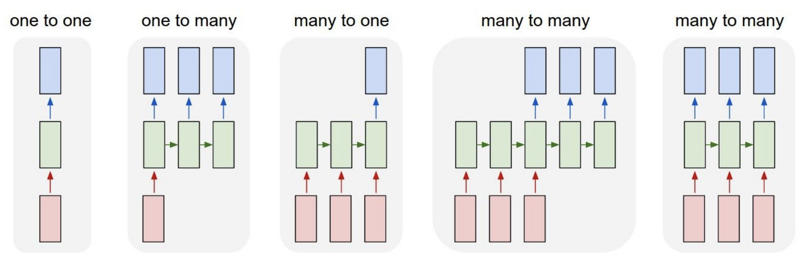

# 回帰型ニューラルネットワーク

!!! info

    この講義ノートは**Student-Contributed Posts**のため、[スケジュールページ](https://cs231n.stanford.edu/schedule.html)には掲載されていません。

## RNN入門

この講義ノートでは、回帰型ニューラルネットワーク (RNN) について説明します。RNNの優れた点の1つは、ニューラル ネットワーク アーキテクチャの接続方法に関して非常に柔軟性が高いことです。通常、ニューラル ネットワーク (図1) を操作する場合、固定サイズの入力ベクトル（赤）が与えられ、それをいくつかの隠し層（緑）で処理し、図1の左端のモデル (**「バニラ」ニューラル ネットワーク**) に示されているように、固定サイズの出力ベクトル（青）を生成します。「バニラ」ニューラル ネットワークは単一の入力を受け取り、その画像に対して1つのラベルを生成しますが、図1の1対多モデルに示されているように、モデルが出力のシーケンスを生成するタスクもあります。**回帰型ニューラルネットワーク**を使用すると、入力、出力、またはその両方を同時に操作できます。

- **１対多モデル**の例としては、固定サイズの画像が与えられ、RNNを通じてその画像の内容を説明する一連の単語を生成する画像キャプションがあります（図1の2番目のモデル）。
- **多対１タスク**の例としては、アクション予測が挙げられます。アクション予測では、図1の3番目のモデルに示すように、単一の画像ではなくビデオ フレームのシーケンスを見て、ビデオで発生していたアクションのラベルを生成します。多対1タスクのもう1つの例は、NLPにおける感情分類です。感情分類では、文の単語のシーケンスが与えられ、その文がどのような感情（肯定的または否定的など）であるかを分類します。
- **多対多タスク**の例としては、ビデオ キャプションの作成が挙げられます。このタスクでは、入力はビデオ フレームのシーケンスで、出力はビデオの内容を説明するキャプションです（図1の4番目のモデルを参照）。多対多タスクのもう1つの例は、NLPの機械翻訳です。このタスクでは、英語の文章の単語のシーケンスを受け取るRNNを用意し、このRNNにフランス語の文章の単語のシーケンスを生成するように要求します。
- 図1の最後のモデルに示されているように、**多対多タスクのバリエーション**もあり、モデルはタイムステップごとに出力を生成します。この多対多タスクの例は、モデルがビデオのすべてのフレームをいくつかのクラスに分類するフレームレベルでのビデオ分類です。この予測は、現在のタイムステップ（ビデオの現在のフレーム）のみの関数ではなく、このビデオの前にあったすべてのタイムステップ（フレーム）の関数にする必要があることに注意してください。

一般的にRNNを使用すると、各タイムステップでの予測がそれ以前のすべてのタイムステップの関数となるアーキテクチャを構築できます。

<figure markdown="span">
    { loading=lazy }
    <figcaption>**図1**: さまざまな (網羅的ではない) タイプの回帰型ニューラルネットワークアーキテクチャ。赤は入力、緑は隠れ層、青は出力ベクトル。 </figcaption>
</figure>

### 既存の畳み込みネットワークが不十分なのはなぜか

既存の畳み込みニューラルネットワークは、入力と出力のシーケンス長が変動するタスクに対応するには不十分です。たとえばビデオキャプショニングでは、入力のフレーム数が変動し（たとえば、10分の動画と10時間の動画）、出力のキャプションも可変長です。畳み込みネットワークは固定の幅と高さを持つ入力しか受け取れず、異なるサイズの入力に対して一般化することができません。この問題に対処するために回帰型ニューラルネットワーク（RNN）を導入します。

### 回帰型ニューラルネットワーク

RNNは基本的にブラックボックス（図2の左側）であり、シーケンスが処理される際に「内部状態」が更新されます。各タイムステップごとに、RNNに入力ベクトルを与え、それを受け取ることによって状態が変更されます。RNNの重みを調整すると、RNNは入力を受け取るごとにその状態がどのように変化するかについて、異なる挙動を示します。また、RNNの状態に基づいて出力を生成することにも関心があるため、RNNの上に出力ベクトルを生成できます（図2を参照）。

RNNモデルを展開すると（図2の右）、 $x_1,x_2,x_3 ... x_t$ として示される異なるタイムステップの入力（たとえばビデオフレーム）が存在します。各タイムステップのRNNは、2つの入力 (1) を取り込み、出力 $y_i$ を生成し、その履歴を更新します。図2（右）のRNNブロックはすべて、同じパラメーターを共有する同じブロックですが、タイムステップごとに異なる入力と履歴を持ちます。
{ .annotate }

1. 入力フレーム ( $x_i$ ) と、これまでの表現（つまり履歴）

<figure markdown="span">
    { loading=lazy }
    <figcaption>**図２**: 簡略化された RNN ボックス (左) と展開された RNN (右)。 </figcaption>
</figure>

より正確には、RNNはパラメーター $W$ を持つ関数 $f_W$ の漸化式として表すことができます：

$$
h_t=f_W(h_{t-1}, x_t)
$$

各タイムステップごとに、前のタイムステップ$t-1$の状態をベクトル$h_{t-1}$として受け取り、現在の入力ベクトル$x_t$とともに処理し、現在の状態をベクトル$h_t$として生成します。重み$W$を持つ固定の関数$f_W$が毎タイムステップに適用されるため、シーケンスの長さに依存せずに回帰型ニューラルネットワークをシーケンス上で使用することが可能になります。これは、入力シーケンスや出力シーケンスがどれだけ長くても、同じ関数を各タイムステップで適用するためです。

もっとも単純な形のRNNはバニラRNNと呼ばれるもので、このネットワークは単一の隠れ状態$h$からなり、前の隠れ状態$h_{t-1}$と現在の入力$x_t$を基に隠れ状態$h$をどのように更新するかを示す漸化式を使用します。具体的には、重み行列 $W_{hh}$ と $W_{xh}$ があり、それらが前のタイムステップの隠れ状態 $h_{t-1}$ と現在の入力$x_t$をそれぞれ射影し、それらを合計して $\tanh$関数で圧縮し、タイムステップ $t$ で隠れ状態 $h_t$ を更新します。この漸化式は、隠れ状態 $h$ がその履歴と現在の入力に基づいてどのように変化するかを示しています：

$$
h_t=\tanh(W_{hh}h_{t-1}+W_{xh}x_t)
$$

{ loading=lazy }

予測は隠れ状態 $h_t$ に基づいて行われ、隠れ状態の上にさらに別の行列射影を適用することで実現できます。これがニューラルネットワークを構築する際のもっとも単純なケースです：

$$
y_t=W_{hy}h_t
$$

<figure markdown="span">
  { loading=lazy }
</figure>

これまでRNNを抽象的なベクトル $x,h,y$ として示してきましたが、次のセクションではこれらのベクトルに意味を持たせることができます。

## 文字レベルの言語モデルとしてのRNNの例

RNNを使用するもっとも単純な方法の1つは、文字レベルの言語モデルです。これは直感的に理解しやすいためです。このRNNの動作は、文字のシーケンスをRNNに入力し、各タイムステップごとに次に来る文字を予測させるというものです。RNNの予測は、RNNがこれまで見たシーケンスの次に来るはずの文字について、語彙のスコア分布という形で行われます。

たとえば、非常にシンプルな例（図3）で、1つの文字列「hello」だけからなる学習シーケンスがあり、データセット全体の語彙が $V \in \{\text{"h"}, \text{"e"}, \text{"l"}, \text{"o"}\}$ の4文字で構成されているとします。この学習データに対して、RNNがシーケンス内の次の文字を予測するように学習させます。

<figure markdown="span">
    { loading=lazy }
    <figcaption>**図3**: 簡略化された文字レベルの言語モデルRNN </figcaption>
</figure>

図3に示すように、最初に「h」、次に「e」、次に「l」、最後に「l」と、1文字ずつRNNに入力します。すべての文字はワンホットベクターと呼ばれる表現でエンコードされ、語彙内のユニークな文字ごとにベクトルのユニークなビットが1つだけオンになります。例：

$$
\begin{bmatrix}1 \\ 0 \\ 0 \\ 0 \end{bmatrix} = \text{"h"}\ \ 
\begin{bmatrix}0 \\ 1 \\ 0 \\ 0 \end{bmatrix} = \text{"e"}\ \ 
\begin{bmatrix}0 \\ 0 \\ 1 \\ 0 \end{bmatrix} = \text{"l"}\ \ 
\begin{bmatrix}0 \\ 0 \\ 0 \\ 1 \end{bmatrix} = \text{"o"}
$$

次に、タイムステップごとに前節の漸化式を使用します。まず、 $h$ をサイズ3のゼロベクトルとして初期化します。この固定された漸化式を使用することで、次の隠れ状態 $h$ の3次元表現を得ることができ、これは基本的にその時点までに来たすべての文字を要約するものになります：

$$
\begin{aligned}
\begin{bmatrix}0.3 \\ -0.1 \\ 0.9 \end{bmatrix} &= f_W(W_{hh}\begin{bmatrix}0 \\ 0 \\ 0 \end{bmatrix} + W_{xh}\begin{bmatrix}1 \\ 0 \\ 0 \\ 0 \end{bmatrix}) \ \ \ \ &(1) \\
\begin{bmatrix}1.0 \\ 0.3 \\ 0.1 \end{bmatrix} &= f_W(W_{hh}\begin{bmatrix}0.3 \\ -0.1 \\ 0.9 \end{bmatrix} + W_{xh}\begin{bmatrix}0 \\ 1 \\ 0 \\ 0 \end{bmatrix}) \ \ \ \ &(2) \\
\begin{bmatrix}0.1 \\ -0.5 \\ -0.3 \end{bmatrix} &= f_W(W_{hh}\begin{bmatrix}1.0 \\ 0.3 \\ 0.1 \end{bmatrix} + W_{xh}\begin{bmatrix}0 \\ 0 \\ 1 \\ 0 \end{bmatrix}) \ \ \ \ &(3) \\
\begin{bmatrix}-0.3 \\ 0.9 \\ 0.7 \end{bmatrix} &= f_W(W_{hh}\begin{bmatrix}0.1 \\ -0.5 \\ -0.3 \end{bmatrix} + W_{xh}\begin{bmatrix}0 \\ 0 \\ 1 \\ 0 \end{bmatrix}) \ \ \ \ &(4)
\end{aligned}
$$

この漸化式を各タイムステップで適用することで、各タイムステップごとにシーケンス内の次の文字を予測します。語彙 $V$ に4つの文字があるため、各タイムステップで4次元のロジットベクトルを予測します。

図3に示されているように、最初のタイムステップでは $\text{"h"}$ を入力し、RNNは現在の重み設定に基づいてロジットのベクトルを計算しました：

$$
\begin{bmatrix}1.0 \\ 2.2 \\ -3.0 \\ 4.1 \end{bmatrix} \rightarrow \begin{bmatrix}\text{"h"} \\ \text{"e"} \\ \text{"l"}\\ \text{"o"} \end{bmatrix}
$$

RNNは、次の文字 $\text{"h"}$ が $1.0$ の確率で、次に $\text{"e"}$ が $2.2$ の確率で、 $\text{"l"}$ が $−3.0$ の確率で、そして $\text{"o"}$ が $4.1$ の確率で来ると予測しています。この場合、RNNは $\text{"o"}$ が次に来るべきだと誤って示唆していますが、実際にはこの学習シーケンスでは $\text{"e"}$ が $\text{"h"}$ の後に続くべきであり、そのため $2.2$ のスコアが正しい答えです（図3で緑色で強調されています）。私たちは、 $2.2$ のスコアが高く、他のスコアが低くなることを望んでいます。

各タイムステップごとに、次にシーケンスに来るべき文字のターゲットがあるため、誤差信号は接続を通じて損失関数の勾配として逆伝播されます。損失関数としてたとえばソフトマックス分類器を選ぶことができ、そうすることですべての損失が上から下に流れ、重み行列の勾配を計算して、正しい確率がRNNから出力されるように行列をシフトさせる方法を見つけます。同様に、モデルの学習を大規模なデータセットにスケールアップする方法を考えることができます。

## マルチレイヤーRNN

これまで、RNNを1つの層だけで示してきましたが、1層のアーキテクチャに限られるわけではありません。今日、RNNはより複雑な方法で使用されています。RNNは多層に積み重ねることができ、経験的により深いアーキテクチャの方がうまく機能する傾向があります（図4）。

<figure markdown="span">
    { loading=lazy width=50% }
    <figcaption>**図4**: マルチレイヤーRNNの例 </figcaption>
</figure>

たとえば、図4にはそれぞれ独自の重みセットを持つ3つの異なるRNNがあり、これらは互いに重ねられています。2番目のRNN（図4の2番目のRNN層）の入力は、最初のRNN（図4の1番目のRNN層）の隠れ状態ベクトルです。すべてのスタックされたRNNは共同で学習されており、図4のダイアグラムは1つの計算グラフを表しています。

## Long-Short Term Memory (LSTM)

これまでバニラRNNのシンプルな漸化式を見てきましたが、実際にはバニラRNNの式を使用することはほとんどありません。代わりにLong-Short Term Memory（LSTM）RNNと呼ばれるものを使用します。

### バニラRNNの勾配フローと勾配消失問題

RNNブロックは入力 $x_t$ と前の隠れ表現 $h_{t-1}$ を受け取り、変換を学習します。この変換は $\tanh$ 関数に渡され、次のタイムステップの隠れ表現 $h_t$ と出力 $y_t$ を生成します。これは以下の方程式に示されています。

$$
h_t = \tanh(W_{hh}h_{t-1} + W_{xh}x_t)
$$

逆伝播のために、最終タイムステップの出力が最初のタイムステップの重みにどのように影響を与えるかを考えてみましょう。$h_t$ を $h_{t-1}$ に対する偏導関数は次のように表されます：

$$
\frac{\partial h_t}{\partial h_{t-1}} =  tanh^{'}(W_{hh}h_{t-1} + W_{xh}x_t)W_{hh}
$$

重み $W_{hh}$ を更新するために、最終タイムステップの損失 $L_t$ を $W_{hh}$ に対して偏微分します。

$$
\begin{aligned}
\frac{\partial L_{t}}{\partial W_{hh}} = \frac{\partial L_{t}}{\partial h_{t}} \frac{\partial h_{t}}{\partial h_{t-1} } \dots \frac{\partial h_{1}}{\partial W_{hh}} \\
= \frac{\partial L_{t}}{\partial h_{t}}(\prod_{t=2}^{T} \frac{\partial h_{t}}{\partial  h_{t-1}})\frac{\partial h_{1}}{\partial W_{hh}} \\
= \frac{\partial L_{t}}{\partial h_{t}}(\prod_{t=2}^{T}  tanh^{'}(W_{hh}h_{t-1} + W_{xh}x_t)W_{hh}^{T-1})\frac{\partial h_{1}}{\partial W_{hh}} \\
\end{aligned}
$$

- **勾配消失**：$\tanh'(W_{hh} h_{t-1} + W_{xh} x_t)$ は常に1未満になるため、$t$ が大きくなるにつれて（つまり、タイムステップが長くなるにつれて）、勾配 $\frac{\partial L_t}{\partial W}$ の値は減少し、ゼロに近づきます。これにより、勾配消失問題が発生し、将来のタイムステップでの勾配が最初のタイムステップの勾配にほとんど影響を与えなくなります。更新が非常に遅くなるため、長い入力シーケンスをモデル化する際に問題となります。
- **非線形（tanh）の除去**：消失勾配問題を解決するために非線形性（tanh）を取り除くと、 $\frac{\partial L_{t}}{\partial W} = \frac{\partial L_{t}}{\partial h_{t}}(\prod_{t=2}^{T} W_{hh}^{T-1})\frac{\partial h_{1}}{\partial W}$ のようになる。
    - 勾配爆発： も$W_{hh}$ の最大特異値が1を超えるた場合、勾配が爆発し将来のタイムステップから非常に大きな勾配が戻ってくることになります。勾配の爆発は、しばしば非数の勾配を得ることにつながります。
    - 勾配消失: 消失勾配： $W_{hh}$ の最大特異値が1より小さい場合、前述の勾配消失問題が発生し、学習が著しく遅くなります。
 
 実際には、大きな勾配値を最大閾値にクリッピングする勾配クリッピングによって爆発勾配問題に対処できます。しかし、 $W_{hh}$ 行列の最大特異値が1未満の場合、消失勾配問題は依然として存在するため、LSTMがこの問題を回避するために設計されました。

### LSTMの定式化

以下はLSTMの正確な定式化です。ステップ $t$ では、隠れ状態 $h_t$ とセル状態 $c_t$ があります。両方ともサイズ $n$ のベクトルです。LSTMがバニラRNNと異なる点は、この追加の $c_t$ セル状態を持っていることで、直感的には $c_t$ が長期的な情報を保存していると考えられます。LSTMはこの $c_t$ セルに対して情報を読み取り、消去し、書き込むことができます。LSTMが $c_t$ セルを変更する方法は、3つの特別なゲート $i, f, o$ を介して行われます。これらはそれぞれ「入力」「忘却」「出力」ゲートに対応します。これらのゲートの値は、閉じた状態（0）から開いた状態（1）まで変化します。すべての $i, f, o$ ゲートはサイズ $n$ のベクトルです。

各タイムステップで、入力ベクトル $x_t$、前の隠れ状態 $h_{t-1}$、前のセル状態 $c_{t-1}$ があり、LSTMは次の隠れ状態 $h_t$ と次のセル状態 $c_t$ をタイムステップ $t$ で次のように計算します：

$$
\begin{aligned}
f_t &= \sigma(W_{hf}h_{t_1} + W_{xf}x_t) \\
i_t &= \sigma(W_{hi}h_{t_1} + W_{xi}x_t) \\
o_t &= \sigma(W_{ho}h_{t_1} + W_{xo}x_t) \\
g_t &= \text{tanh}(W_{hg}h_{t_1} + W_{xg}x_t) \\
\end{aligned}
$$

<figure markdown="span">
  { loading=lazy width=70% }
</figure>

$$
\begin{aligned}
c_t &= f_t \odot c_{t-1} + i_t \odot g_t \\
h_t &= o_t \odot \text{tanh}(c_t) \\
\end{aligned}
$$

<figure markdown="span">
  { loading=lazy }
</figure>

ここで、$\odot$ は要素ごとのアダマール積を表します。上記の式における $g_t$ は、中間計算のキャッシュであり、後に上記の式で出力ゲート $o$ とともに使用されます。

すべての忘却ゲート $f$、入力ゲート $i$、出力ゲート $o$ のベクトルの値は、シグモイド関数 $\sigma$ によって圧縮されているため、0から1の範囲に収まります。これらが要素ごとに積算されると、次のことがわかります：

- **忘却ゲート**：タイムステップ $t$ での忘却ゲート $f_t$ は、前のセル状態 $c_{t-1}$ からどれだけの情報を「削除」するかを制御します。この忘却ゲートは、前のタイムステップからの隠れ表現を消去することを学習します。そのため、LSTMは2つの隠れ表現、すなわち隠れ状態 $h_t$ とセル状態 $c_t$ を持つことになります。セル状態 $c_t$ は時間を経て伝播し、前のセル状態を忘れるかどうかを学習します。
- **入力ゲート**：タイムステップ $t $ における入力ゲート $i_t$ は、前の隠れ状態 $h_{t-1}$ および入力 $x_t$ から次のセル状態 $c_t$ にどれだけの情報を「追加」するかを制御します。 $\tanh$ の代わりに、入力ゲート $i $ はシグモイド関数を使用し、入力を0から1の間の値に変換します。これにより、値がほぼ0か1として機能するスイッチの役割を果たします。この入力ゲートは、RNNの出力が「ゲート」ゲート $g$ によって生成され、その出力を入力ゲート $i$ と掛け合わせるかどうかを決定します。
- **出力ゲート**：タイムステップ $t$ における出力ゲート $o_t$ は、現在の隠れ状態 $h_t$ で「表示」するべき情報の量を制御します。

LSTMの重要な考え方はセル状態であり、再帰的なタイムステップの間を通る水平線です。セル状態とは、わずかな線形相互作用があるだけで、チェーン全体をまっすぐに通り抜ける情報の高速道路のようなものだと考えることができます。上記の式により、情報がこの高速道路をスムーズに流れることが容易になります（図5）。そのため、LSTMが何個も積み重なっていても勾配がすべての時間ステップで消滅することなく、隠れた状態 $h$ の代わりにセルの状態を通って戻ってくるような、途切れることのない勾配の流れを得ることができます。

これにより、先に説明した勾配消失や爆発の問題が大幅に解消されます。図5にも示されているように、勾配には「忘却」ゲートの活性化ベクトルが含まれています。これにより、「忘却」ゲートの適切なパラメーター更新を通じて、勾配値をより適切に制御できるようになります。

<figure markdown="span">
    { loading=lazy }
    <figcaption>**図5**: LSTMのセル状態の高速道路。 </figcaption>
</figure>

### LSTMは勾配消失問題を解決するか

LSTMアーキテクチャは、RNNが多数の再帰的タイムステップにわたって情報を保持しやすくします。たとえば、忘却ゲートが1に設定され、入力ゲートが0に設定されている場合、セル状態の情報は多くの再帰的タイムステップにわたって常に保持されます。一方、バニラRNNの場合、単一の重み行列を使用するだけでは、再帰的タイムステップで隠れ状態に情報を保持するのは非常に困難です。
