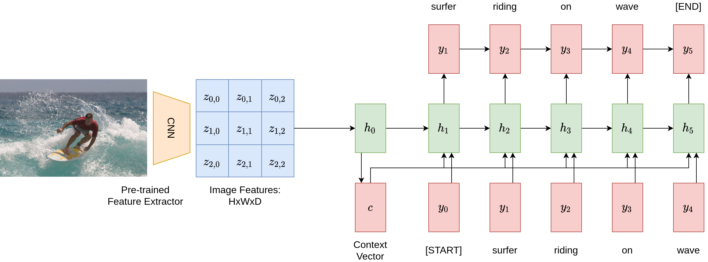
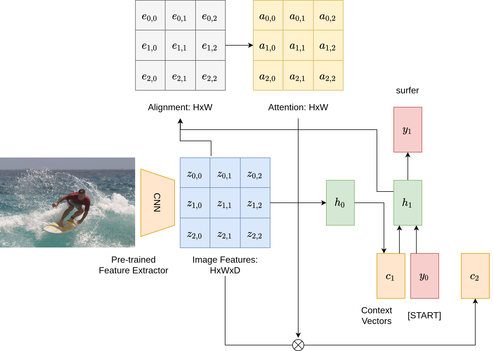
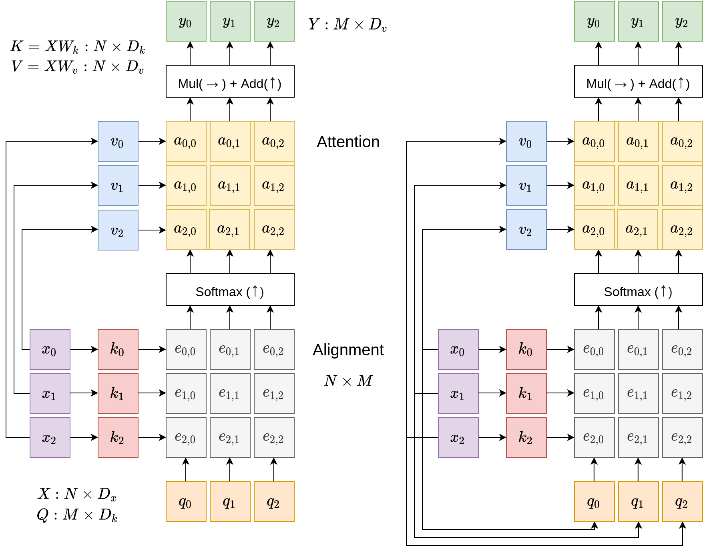
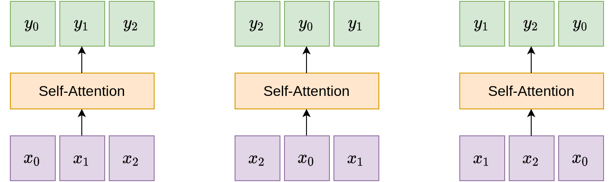
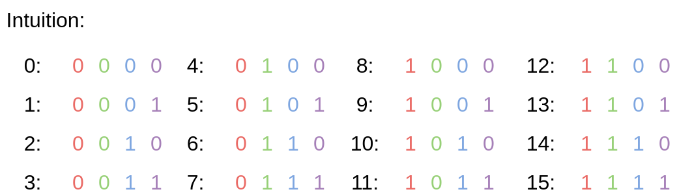
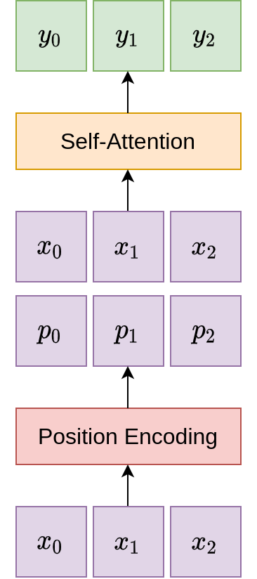
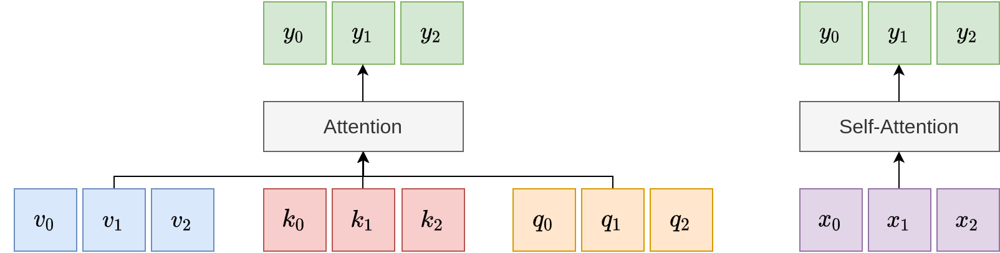
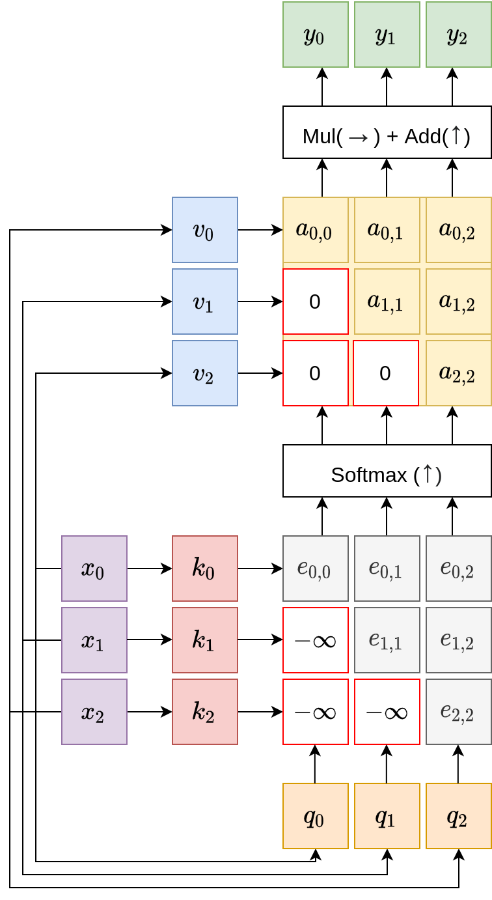
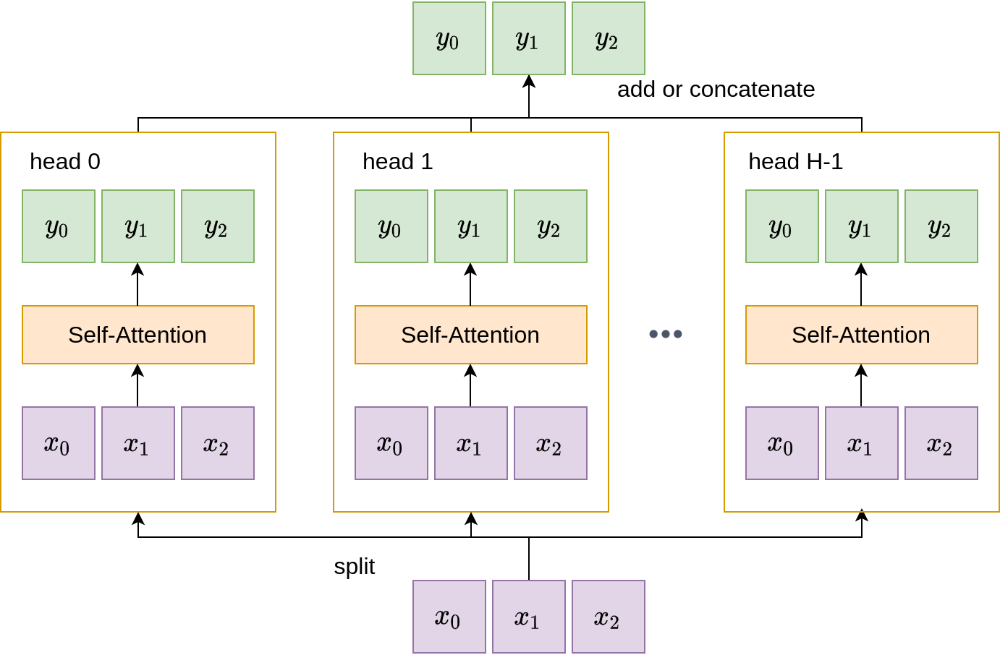

# Attention

!!! info

    この講義ノートは[スケジュールページ](https://cs231n.stanford.edu/schedule.html)には掲載されていません。

これまでのセクションでは、畳み込みニューラルネットワークや回帰型ニューラルネットワーク（RNN）といった現代のディープラーニングにおける基礎的な中核技術について説明しました。このセクションでは、現代のコンピュータービジョンとNLPアプリケーションの新しいプリミティブを形成する、さらに新しい層である**「Attention層」**に焦点を当てます。

## 動機

Attention層の動機づけのために、サンプルアプリケーションである画像キャプションを見てみましょう。

以下の図は、与えられた画像に対してこのようなネットワークを適用し、キャプションを生成するパイプラインを示しています。まず、事前訓練されたCNN特徴抽出器を使用して画像を要約し、画像特徴ベクトル $c = h_0$ を得ます。次に、回帰型ニューラルネットワークを適用して、各ステップでトークンを繰り返し生成します。5つのタイムステップの後、画像キャプション生成モデルは「surfer riding on wave」という文を得ます。

<figure markdown="span">
    { loading=lazy }
</figure>

なにが問題でしょうか？このモデルは、キャプションを記述する際にコンテキストベクトル $c$ に完全に依存しています。つまり、画像に関して言いたいことすべてをこのベクトルに圧縮する必要があるということです。もし、サーファーのシャツの色や波の向きといった非常に細かい詳細を具体的に説明したい場合はどうでしょうか？明らかに、有限長のベクトルではこれらすべての可能性を符号化することはできません。とくに、必要なトークン数が数百、数千に及ぶ場合はなおさらです。

Attention層の中心的なアイデアは、人間の視覚的な注意システムから借用されています。私たち人間が視覚的なシーンを与えられ、そのシーンの特定の領域を理解しようとする際、私たちはその領域に視線を集中させます。Attention層はこのプロセスをシミュレートし、画像を説明する言葉を生成しながら、画像のさまざまな部分に注意を向けます。

Attentionが導入された場合、画像キャプション生成のパイプラインは以下の図のようになります。主な違いは何でしょうか？アライメントスコア用とAttention用の2つの行列が追加されています。また、異なるステップごとに異なる文脈ベクトル $c_i$ を持っています。各ステップで、モデルは現在の隠れベクトル $h_i$ と入力画像の特徴を処理するために多層パーセプトロンを使用し、形状が $H \times W$ のアライメントスコア行列を生成します。このスコア行列はソフトマックス層に渡され、重みの合計が1になるAttention行列に変換されます。Attention行列の重みは画像の特徴と要素ごとに掛け合わされ、モデルが異なる画像領域に焦点を当てられるようにします。このプロセス全体は微分可能であり、モデルは自身のAttentionの重みを選択できるようになります。

<figure markdown="span">
    { loading=lazy }
</figure>

## 一般的なAttention層

前節では画像キャプションにおけるAttention層の応用について詳述しましたが、次に、画像キャプションや回帰型ニューラルネットワークの設定から切り離した、より一般的で原則的なAttention層の定式化を紹介します。一般的な設定では、Attention層は入力ベクトルと出力ベクトルを持ち、5つの主要な操作からなる層です。これらは以下の図に示されています。

<figure markdown="span">
    { loading=lazy }
    <figcaption>左：一般的なAttention層 右：Self-Attention層 </figcaption>
</figure>

図に示されているように、Attention層への入力は、形状が $N \times D_x$の入力ベクトル $X$ と、形状が $M \times D_k$ のクエリベクトル $Q$ です。画像キャプションの例では、入力ベクトルは画像の特徴量であり、クエリベクトルは回帰型ネットワークにおける隠れ状態です。Attention層の出力は、上部にある形状 $M \times D_k$ のベクトル $Y$ です。

Attention操作の大部分は、図の中央にあるカラフルなグリッドとして示されており、2つの主要な操作が含まれています。1つ目はキーと値の線形変換で、2つ目は先ほどの画像キャプショニングの例で見た「整列（アライメント）とAttention」操作です。

### 操作

**キーと値の線形変換**: 入力ベクトル $X$ を2つの別のベクトルセットに変換する線形変換です：

- キーベクトル $K$ ：これらのベクトルは、線形方程式 $K = XW_k$ を使用して得られます。ここで、$W_k$ は学習可能な重み行列であり、形状は $D_x \times D_k$ です。これにより、入力ベクトルの次元 $D_x$ からキーの次元 $D_k$ へ変換されます。結果として得られるキーは、クエリベクトルと同じ次元を持ち、整列（アライメント）が可能になります。
- 値ベクトル $V$ ：同様に、これらのベクトルを導出するための方程式は $V = XW_v$ です。ここで、$W_v$ の形状は $D_x \times D_v$ です。値ベクトルは出力ベクトルと同じ次元を持ちます。

入力の上にこれらの完全連結層を適用することで、Attentionモデルはさらなる表現力を獲得します。

**整列**：Attention層の核となるのは、整列とAttentionという2つの基本的な操作です。整列ステップではより複雑な関数も可能ですが、実務者はベクトル間の単純な関数、すなわちキーベクトルとクエリベクトルのペア毎のドット積を選択することが多いです。

さらに、次元が大きいベクトルでは、ドット積で乗算されて合計される項が多くなり、通常分散が大きくなります。大きなベクトルは結果のソフトマックス計算に対してより多くの重みを寄与し、通常は多くの項が低いAttentionを受けます。この問題に対処するために、スケーリング係数として $\sqrt{D_x}$ の逆数が組み込まれることがよくあり、アライメントスコアを減少させます。このスケーリング手法は、大きな項の影響を減少させることで、結果として得られるAttentionの重みがより分散するようにします。アライメントの計算は以下の方程式で要約できます：

$$
e_{i,j} = \frac{q_j \cdot x_i}{\sqrt{D_x}}
$$

**Attention**：Attention行列は、アライメント行列にソフトマックス関数を列方向に適用することで得られます。

$$
\mathbf{a} = \text{softmax}(\mathbf{e})
$$

出力ベクトルは、最終的にAttention行列と入力ベクトルの乗算として計算されます：

$$
y_j = \sum_{i} a_{i,j} x_i
$$

## Self-Attention

一般的なAttention層について説明しましたが、Self-Attention層は特別なケースを指します。ここでは、キーとバリューのベクトルと同様に、クエリベクトル $Q$ も入力ベクトルの線形変換として表現されます。具体的には、$Q = XW_q$ と表されます。ここで $W_q$ の形状は $D_x \times D_k$ です。このようにクエリベクトルを入力の一次関数として表現することで、Attention層は自己完結型になります。これは、上の図の右側に示されています。

**順序不変性**：注目すべきは、Self-Attention層は入力ベクトルの順序に対して不変であるということです。

<figure markdown="span">
    { loading=lazy }
    <figcaption>Self-Attention層の順序不変性</figcaption>
</figure>

**位置エンコーディング**：Self-Attention層は入力の順序に無関係ですが、実用的なアプリケーションではしばしば順序の概念が必要とされます。たとえば、自然言語シーケンスでは、単語の相対的な順序が、文全体の意味を区別する上で極めて重要な役割を果たすことが多いです。このため、入力の位置を決定する能力をモデルに与えるために、Self-Attentionモジュールに位置エンコーディングのコンポーネントを含める必要があります。このコンポーネントにはいくつかの条件が必要です：

- 位置エンコーディングは、各時間ステップで*一意*でなければなりません。
- 連続する2つのエンコーディング間の*距離*は同じでなければなりません。
- 位置エンコード機能は、任意の*長さ*のシーケンスに一般化されるべきです。
- 関数は*決定論的*でなければならなりません。

上記の条件を満たす関数は数多く存在しますが、一般的に使用されている方法は、サインとコサインの混合値を使用するものです。具体的には以下のようなエンコード関数となります：

$$
p(t)=[\sin(w_1 \cdot t), \cos(w_1 \cdot t), \sin(w_2 \cdot t), \cos(w_2 \cdot t), \cdots, \sin(w_{d/2} \cdot t), \cos(w_{d/2} \cdot t)]
$$

なお周波数 $w_k = \frac{1}{10000^{2k/d}}$です。この関数は何をエンコードしているのでしょうか？次の図は、同じ現象をバイナリー領域で直感的に説明したものです：

<figure markdown="span">
    { loading=lazy }
</figure>

周波数 \( w_k \) は、二進数の場合の0と1のように、入力の相対的な位置を表すために変化します。実際には、位置エンコーディングコンポーネントは、Self-Attentionモジュールに渡される前に、入力ベクトルに追加情報を連結します：

<figure markdown="span">
    { loading=lazy width=50% }
</figure>

**一般的なAttentionとSelf-Attentionの比較**：一般的なAttention層は、キー、値、クエリーの3つのベクトルセットにアクセスできます。これに対して、Self-Attention層は完全に自己完結的であり、代わりに3つのベクトルセットを入力の一次関数としてパラメーター化します。

<figure markdown="span">
    { loading=lazy }
</figure>

### Masked Self-Attention層

位置エンコーディング層はいくつかの位置情報を統合しますが、より重要なアプリケーションでは、相対的な入力の順序に関する明確なアイデアをモデルに浸透させ、将来のベクトルを先読みしないようにする必要がある場合があります。この目的のために、Masked Self-Attention層が作成されました。これはアラインメント行列の下三角部分を明示的に負の無限大値に設定し、モデルが前のベクトルを処理している間、対応する未来のベクトルを無視します。

<figure markdown="span">
    { loading=lazy width=50% }
</figure>

### Multi-Head Self-Attention層

モデルの表現力を高める別の可能性は、Multi-Head Self-Attentionの概念を活用することです。単一のSelf-Attention層を使用する代わりに、Multi-Head Self-Attentionは複数の並列Attention層を利用します。場合によっては、全体の計算量を維持するためにキーと値の次元 \(D_k\) と \(D_v\) を適切に減少させることができます。複数のAttentionヘッドを使用する利点は、モデルが入力ベクトルの異なる側面に焦点を当てることを可能にすることです。

<figure markdown="span">
    { loading=lazy width=70% }
</figure>

## まとめ

このセクションを要約すると

- ディープラーニングで人気のある新しい層である**Attention**層を動機付け、紹介しました。
- その一般的な定式化を紹介し、とくに**アラインメントとアテンダント**操作の詳細を学びました。
- 次に、**Self-Attention**層のケースに特化しました。
- Self-Attention層は入力ベクトルに対して**順序不変**であることを学びました。
- 位置情報を保持するために、Self-Attention層は**位置エンコード**関数を使用します。
- さらに、純粋なSelf-Attention層の2つの拡張についても学びました。それは、**masked** attention層と**multi-head** attention層です。前者はモデルが未来を見越すのを防ぎ、後者はモデルの表現力を高める役割を果たします。

## その他の資料

- [Show, Attend and Tell: Neural Image Caption Generation with Visual Attention](http://proceedings.mlr.press/v37/xuc15.pdf)は、Attention層の画像キャプションへの応用を紹介しています。
- [Women also Snowboard: Overcoming Bias in Captioning Models](https://arxiv.org/pdf/1803.09797)は、画像キャプションモデルにおけるジェンダーバイアスを検出するためにAttention層を利用しています。
- [Neural Machine Translation by Jointly Learning to Align and Translate](https://arxiv.org/pdf/1409.0473.pdf)は、自然言語翻訳にAttentionを適用しています。
- [Attention is All You Need](https://arxiv.org/pdf/1706.03762.pdf)は、AttentionベースのTransformersに関する代表的な論文で、ビジョンとNLPのコミュニティに旋風を巻き起こしました。