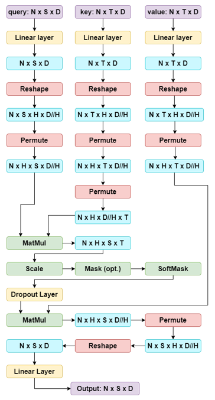

# Transformers

## Transformerの概要

Vaswaniらは「[Attention Is All You Need](https://arxiv.org/abs/1706.03762)」の中で、Transformerを紹介しました。Transformerは並列処理を導入し、モデルが長距離依存関係を学習できるようにするもので、RNNの2つの重要な問題、すなわち学習速度の遅さと長距離依存関係の符号化の難しさを解決するのに役立ちます。Transformerは拡張性と並列性が非常に高く、トレーニングの高速化、モデルの大規模化、視覚および言語タスク全体でのパフォーマンスの向上を実現します。TransformerはRNNとLSTMに取って代わりつつあり、まもなく畳み込みにも取って代わる可能性があります。

## なぜTransformersなのか？

- Transformersは、attention計算がすべての入力を調べるため、長い入力シーケンスの処理に最適です。対照的に、RNNは長距離の依存関係をエンコードするのに苦労します。LSTMは、入力ゲート、出力ゲート、および忘却ゲートを使用して長距離の依存関係をキャプチャするのに非常に優れています。
- Transformersは、順序付けされていない集合または、位置エンコーディング（順序情報の追加）を使用して順序付けされたシーケンス上で動作できます。対照的に、RNN/LSTMは順序付けられた入力シーケンスを想定しています。
- Transformersは並列計算を使用し、すべての入力のすべてのalignmentとattentionスコアの処理を並列に実行できます。対照的にRNN/LSTMは、現在のタイムステップでの隠し状態は前の状態が計算された後にのみ計算できるため、学習に時間がかかることがよくあります。

## Multi-Headed Attention

Transformersの理解に役立つように、attentionユニットの概念を復習しましょう。

- **ドット積のAttention**

$$
c = \sum_{i=1}^n v_i \alpha_i \alpha_i = \frac{\exp(k_i^Tq)}{\sum_{j=1}^n \exp(k_j^Tq)}
$$

クエリ $q$（$D$ 次元）、 値ベクトル $\{v_1, \dots, v_n\}$（各 $v_i$ が $D$ 次元）、キー ベクトル $\{k_1, \dots, k_n\}$（各 $k_i$ が $D$ 次元）、Attention重み $a_i$、および出力 $c$（$D$）が与えられている場合、出力は値ベクトルに対する加重平均として計算されます。

- **Self-Attention**：入力から値、キー、クエリーを導出します。

$$
\begin{aligned}
v_i &= V_{x_i} \, i \in \{1, \dots, \ell\} \\
k_i &= K_{x_i} \, i \in \{1, \dots, \ell\} \\
q_i &= Q_{x_i} \, i \in \{1, \dots, \ell\} \\
\end{aligned}
$$

上記の2つを組み合わせることで、Transformersにマルチヘッドのスケールされたドット積Attentionを実装できるようになりました。

- **Multi-Headed Scaled Dot Product Attention**: 各ヘッド $i$ に対して、学習可能なパラメーター行列 $V_i$、$K_i$、および $Q_i$ を導入します。それぞれの行列はサイズ $D \times D$ で、異なる部分に注目することで、モデルの表現力を高めます。また、スケールされたドット積のAttentionに対して、スケーリング項 $1/\sqrt{d/h}$ を適用します。このスケーリングは、入力ベクトルの大きな値の影響を抑え、安定した学習を可能にします。

$$
Y_i = \text{softmax}(\frac{(XQ_i)(XK_i)^T}{\sqrt{\frac{d}{h}}})(XV_i)
$$

次に、ドロップアウトを適用し、アテンション レイヤーの出力を生成し、最後にアテンション操作の出力に線形変換を追加します。これにより、モデルはヘッド間の関係を学習できるようになり、モデルの表現力が向上します。

### 中間次元による段階的なMulti-Headed Attention

Multi-Headed Attention全体では多くのことが起きているため、このチャートが中間ステップと各ステップ後の次元の変化をさらに明確にするのに役立つことを願っています。

<figure markdown="span">
    { loading=lazy }
    <figcaption>中間次元による段階的なMulti-Headed Attention</figcaption>
</figure>

### PermuteとReshapeに関するヒント