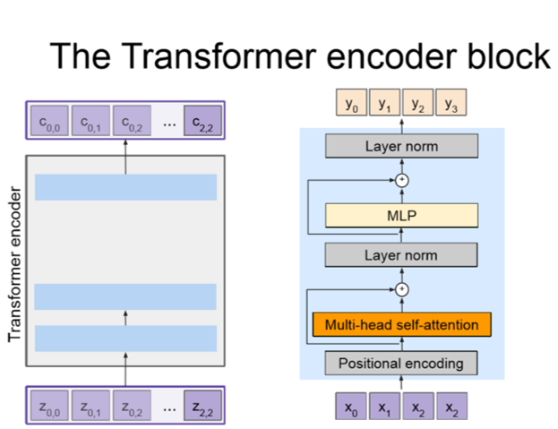
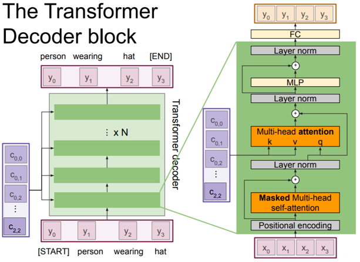

# Transformers

!!! info

    この講義ノートは[スケジュールページ](https://cs231n.stanford.edu/schedule.html)には掲載されていません。

## Transformerの概要

Vaswaniらは「[Attention Is All You Need](https://arxiv.org/abs/1706.03762)」の中で、Transformerを紹介しました。Transformerは並列処理を導入し、モデルが長距離依存関係を学習できるようにするもので、RNNの2つの重要な問題、すなわち学習速度の遅さと長距離依存関係の符号化の難しさを解決するのに役立ちます。Transformerは拡張性と並列性が非常に高く、トレーニングの高速化、モデルの大規模化、視覚および言語タスク全体でのパフォーマンスの向上を実現します。TransformerはRNNとLSTMに取って代わりつつあり、まもなく畳み込みにも取って代わる可能性があります。

## なぜTransformersなのか？

- Transformersは、attention計算がすべての入力を調べるため、長い入力シーケンスの処理に最適です。対照的に、RNNは長距離の依存関係をエンコードするのに苦労します。LSTMは、入力ゲート、出力ゲート、および忘却ゲートを使用して長距離の依存関係をキャプチャするのに非常に優れています。
- Transformersは、順序付けされていない集合または、位置エンコーディング（順序情報の追加）を使用して順序付けされたシーケンス上で動作できます。対照的に、RNN/LSTMは順序付けられた入力シーケンスを想定しています。
- Transformersは並列計算を使用し、すべての入力のすべてのalignmentとattentionスコアの処理を並列に実行できます。対照的にRNN/LSTMは、現在のタイムステップでの隠し状態は前の状態が計算された後にのみ計算できるため、学習に時間がかかることがよくあります。

## Multi-Headed Attention

Transformersの理解に役立つように、attentionユニットの概念を復習しましょう。

- **ドット積のAttention**

$$
c = \sum_{i=1}^n v_i \alpha_i \alpha_i = \frac{\exp(k_i^Tq)}{\sum_{j=1}^n \exp(k_j^Tq)}
$$

クエリ $q$（$D$ 次元）、 値ベクトル $\{v_1, \dots, v_n\}$（各 $v_i$ が $D$ 次元）、キー ベクトル $\{k_1, \dots, k_n\}$（各 $k_i$ が $D$ 次元）、Attention重み $a_i$、および出力 $c$（$D$）が与えられている場合、出力は値ベクトルに対する加重平均として計算されます。

- **Self-Attention**：入力から値、キー、クエリーを導出します。

$$
\begin{aligned}
v_i &= V_{x_i} \, i \in \{1, \dots, \ell\} \\
k_i &= K_{x_i} \, i \in \{1, \dots, \ell\} \\
q_i &= Q_{x_i} \, i \in \{1, \dots, \ell\} \\
\end{aligned}
$$

上記の2つを組み合わせることで、Transformersにマルチヘッドのスケールされたドット積Attentionを実装できるようになりました。

- **Multi-Headed Scaled Dot Product Attention**: 各ヘッド $i$ に対して、学習可能なパラメーター行列 $V_i$、$K_i$、および $Q_i$ を導入します。それぞれの行列はサイズ $D \times D$ で、異なる部分に注目することで、モデルの表現力を高めます。また、スケールされたドット積のAttentionに対して、スケーリング項 $1/\sqrt{d/h}$ を適用します。このスケーリングは、入力ベクトルの大きな値の影響を抑え、安定した学習を可能にします。

$$
Y_i = \text{softmax}(\frac{(XQ_i)(XK_i)^T}{\sqrt{\frac{d}{h}}})(XV_i)
$$

次に、ドロップアウトを適用し、アテンション レイヤーの出力を生成し、最後にアテンション操作の出力に線形変換を追加します。これにより、モデルはヘッド間の関係を学習できるようになり、モデルの表現力が向上します。

## 中間次元による段階的なMulti-Headed Attention

Multi-Headed Attention全体では多くのことが起きているため、このチャートが中間ステップと各ステップ後の次元の変化をさらに明確にするのに役立つことを願っています。

<figure markdown="span">
    { loading=lazy }
    <figcaption>中間次元による段階的なMulti-Headed Attention</figcaption>
</figure>

### PermuteとReshapeに関するヒント

複数のヘッドを作成するには、埋め込み次元をヘッドの数で割り、Reshapeを使用します (1) 。注意すべき点は、Reshapeはデータの順序を変更しないということです。単に元のデータを受け取り、指定した寸法に「変形」するだけです。Permute（またはTranspose）を使って、データの次元の順序を並べ替えます (2) 。最後のMatMul操作の後、なぜReshapingの前にPermuteを使う必要があったかに注目してください。現在のテンソルは（$N \times H \times S \times D//H$）の形状をしていましたが、それを（$N \times S \times D$）に変形するためには、まず $H$ と $D//H$ の次元が隣り合っていることを確認する必要がありました。したがって、まずPermuteを使って次元を（$N \times H \times S \times D//H$）から（$N \times S \times H \times D//H$）に並べ替え、それからreshapeを使って（$N \times S \times D$）の形状を得ることができます。
{ .annotate }

1. 例：Reshapeを使用すると、形状（$N \times S \times D$）から（$N \times S \times H \times D // H$）にできます。
2. 例：Permuteを使えば、次元を（$N \times S \times H \times D // H$）から（$N \times H \times S \times D // H$）に並べ替えることができます。

## Transformerの手順: Encoder-Decoder

### エンコーダーブロック

Encoderブロックの役割は、すべての画像特徴（事前に学習されたCNNで抽出された空間的特徴）をコンテキストベクトルの集合にエンコードすることです。出力されたコンテキストベクトルは、入力シーケンスを高次元空間で表現するものです。エンコーダーを $c = T_W(z)$ と定義します。ここで、$z$ は空間的なCNN特徴量、$T_W(.)$ はtransformerエンコーダーを表します。「Attention Is All You Need」論文では、transformerエンコーダーブロックは、 $N$ 個のエンコーダーブロック（$N = 6, D = 512$）で構成されていることが説明されています。

<figure markdown="span">
    { loading=lazy }
    <figcaption>エンコーダーブロック</figcaption>
</figure>

それでは、エンコーダーブロックの手順を見ていきましょう！

- まず、入力ベクトル $X$（各入力ベクトルはたとえば単語を表す）の集合を取り込みます。
- 次に、入力ベクトルに位置エンコーディングを加えます。
- 位置エンコードされたベクトルを**Multi-Headed Attention層**（各ベクトルが他のすべてのベクトルに注目する）に通します。この層の出力はコンテキストベクトルの集合を生成します。
- Multi-Headed Attention層の後に残差接続を有しており、Attention層が必要なければそれをバイパスできます。
- 次に、各ベクトルを正規化するレイヤー正規化を出力に適用します。
- 次に、各ベクトルに対して個別にMLPを適用します。
- そして、もうひとつの残差接続があります。
- 最後のレイヤー正規化。
- そして最後に、コンテキストベクトルの集合 $C$ が出力されます！

### デコーダーブロック

デコーダーブロックは、エンコーダブロックから出力されたコンテキストベクトル $C$ と入力ベクトル $X$ の集合を取り込み、出力シーケンスを定義するベクトル $Y$ の集合を出力します。デコーダーを $y_t = T_S(y_{0:t-1},c)$ と定義し、$T_D( .)$ はtransformerデコーダーです。「Attention Is All You Need」論文では、 $N$ 個のデコーダーブロック（$N = 6, D = 512$）からなるtransformerデコーダーブロックが使用されています。

<figure markdown="span">
    { loading=lazy }
    <figcaption>デコーダーブロック</figcaption>
</figure>

それでは、デコーダーブロックの手順を見ていきましょう！

- 入力ベクトル $X$ とコンテキストベクトル $C$（エンコーダーブロックから出力される）の集合を取り込みます。
- 次に、入力ベクトル $X$ に位置エンコーディングを加えます。
- 位置エンコードされたベクトルをMasked Self-Attention層に通します。マスクは、前の入力にのみ注意を向けることを保証します。
- この層の後に残差接続があり、Attention層が不要な場合はこれをバイパスできます。
- 次に、各ベクトルを正規化するレイヤー正規化を出力に適用します。
- 次に、エンコーダブロックによって出力されたコンテキストベクトルとレイヤー正規化の出力を取り込む別のMulti-Headed Attention層に出力を通します。このステップでは、Keyはコンテキストベクトル $C$ の集合から、Valueはコンテキスト・ベクトル $C$ の集合から、Queryはレイヤー正規化のステップの出力から来ます。
- そして、もうひとつの残差接続があります。
- 別のレイヤー正規化を適用します。
- 各ベクトルに対して個別にMLPを適用します。
- もうひとつの残差接続。
- 最後のレイヤー正規化。
- そして最後に、出力を完全連結層に通し、最終的な出力ベクトルの集合 $Y$ を生成します。

### レイヤーの正規化とMLPに関する補足事項

**レイヤーの正規化**：エンコーダーとデコーダーブロックの実装で見たように、エンコーダーとデコーダーブロックの両方で、残差接続の後にレイヤー正規化を使用しています。レイヤー正規化では、特徴次元全体にわたって正規化している（つまり、画像特徴に対してLayerNormを適用している）ことを思い出してください。これらの箇所でレイヤー正規化を使うことで、勾配の消失や爆発を防ぎ、ネットワークを安定させ、訓練時間を短縮できます。

**MLP**：エンコーダーとデコーダーブロックの両方には、位置ごとの全結合feed-forwardネットワークが含まれています。これらのネットワークは、各位置に対して個別に同一の処理が適用されます（Vaswaniら）。線形変換は層ごとに異なるパラメーターを使用します。

$$
\text{FFN}(x) = \max(0, xW_1 + b_1)W_2 + b_2
$$

また、self-attention層と位置ごとのfeed-forward層を組み合わせることで、従来の畳み込み層が必要とする計算複雑性を削減できます。

## その他の資料

実装に関連するその他の資料：

- [Attention is All You Need](https://arxiv.org/pdf/1706.03762.pdf)
